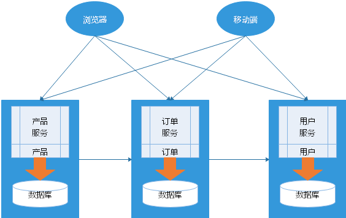

# 传统架构与微服务架构的区别

## 系统架构需要遵循的三个标准

- 提高敏捷性：及时响应业务需求，促进企业发展
- 提升用户体验：提升用户体验，减少用户流失
- 降低成本：降低增加产品、客户或业务方案的成本

## 传统的开发模式

先来看看传统的 WEB 开发方式，通过对比比较容易理解什么是 **微服务架构**。和 **微服务** 相对应的，这种方式一般被称为 **单体式开发（Monolithic）**。

既所有的功能打包在一个 WAR 包里，基本没有外部依赖（除了容器），部署在一个 JavaEE 容器（Tomcat，JBoss，WebLogic）里，包含了 DO/DAO，Service，UI 等所有逻辑。

### 优点

- 开发简单，集中式管理
- 基本不会重复开发
- 功能都在本地，没有分布式的管理和调用消耗

### 缺点

- 效率低：开发都在同一个项目改代码，相互等待，冲突不断
- 维护难：代码功功能耦合在一起，新人不知道何从下手
- 不灵活：构建时间长，任何小修改都要重构整个项目，耗时
- 稳定性差：一个微小的问题，都可能导致整个应用挂掉
- 扩展性不够：无法满足高并发下的业务需求

## 微服务架构

### 目的

有效的拆分应用，实现敏捷开发和部署

### 开发和交付中的伸缩立方

**X轴：** 运行多个负载均衡器之后的运行实例 **Y轴：** 将应用进一步分解为微服务（分库） **Z轴：** 大数据量时，将服务分区（分表）