# 持续交付实战用户管理服务

## 写在前面

Jenkins 的持续交付流程与 GitLab Runner 的持续集成差不多，但 GitLab Runner 已经默认是配置好了 Git，所以 Jenkins 需要额外配置多一个 GitLab 的 SSH 登录。按照之前 GitLab Runner 的持续集成流程，Jenkins 的持续交付流程大致如下（其实原理还是挺简单的，但对于刚刚接触 Jenkins 同学理解起来可能还是有一点难度的，最好看下本节视频加深理解）：

- 拉取代码
- 打包构建
- 上传镜像
- 运行容器
- 维护清理

## 配置 Jenkins 的 GitLab SSH 免密登录

步骤同 [使用 SSH 的方式拉取和推送项目](https://www.funtl.com/zh/gitlab/GitLab-创建第一个项目.html#使用-ssh-的方式拉取和推送项目)

- 交互式进入 Jenkins 容器

```shell
docker exec -it jenkins /bin/bash
```

- 生成 SSH KEY

```shell
ssh-keygen -t rsa -C "your_email@example.com"
```

- 查看公钥

```shell
cat /var/jenkins_home/.ssh/id_rsa.pub
```

- 复制公钥到 GitLab


- **手动克隆一次项目**，该步骤的主要作用是为了生成和服务器的验证信息


- 查看刚才生成的文件


## 配置 Publish over SSH

- `系统管理` -> `系统设置` -> `Publish over SSH`


其中 `Remote Directory` 是指 Jenkins 可以在目标服务器操作的目录

- 测试是否能够正常通信

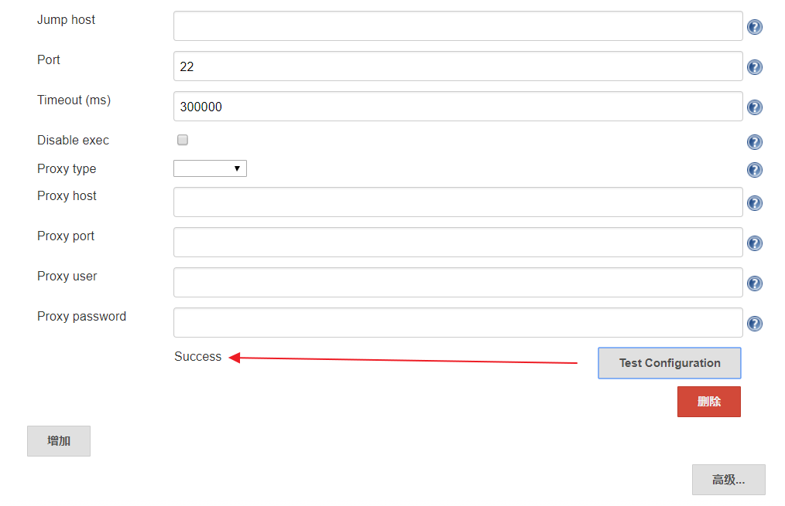

- **别忘记保存**

## 持续交付依赖管理项目

由于我们所有项目的父工程都是依赖于 `myshop-dependencies`，所以我们的第一步是实现该项目的持续交付

### 为项目创建标签

在 GitLab 中为项目创建标签

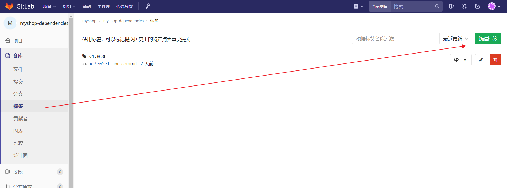


### 创建 Maven Project

在 Jenkins 中创建一个基于 Maven 的任务

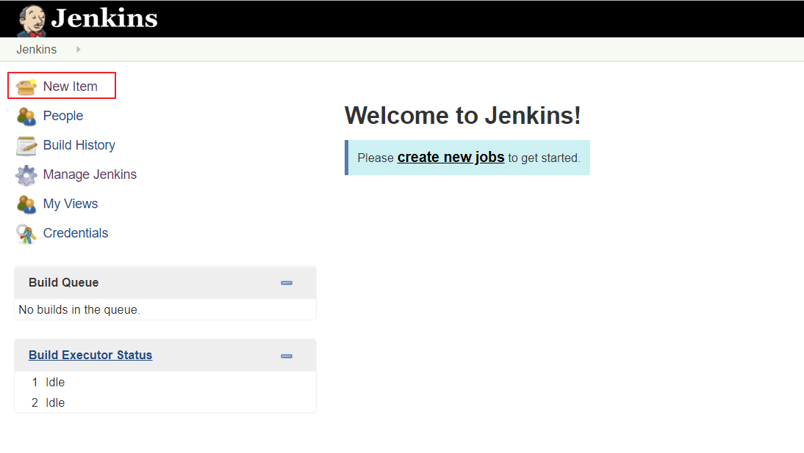


### 配置 Maven Project

#### 配置第一次构建


- 构建项目


- 查看构建日志

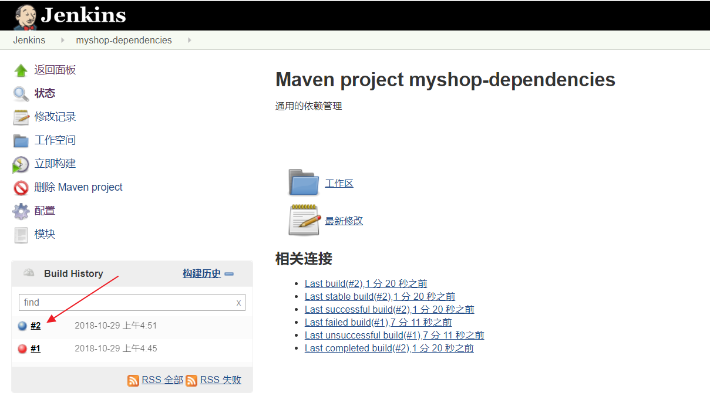


#### 配置正式构建

- 增加参数化构建过程

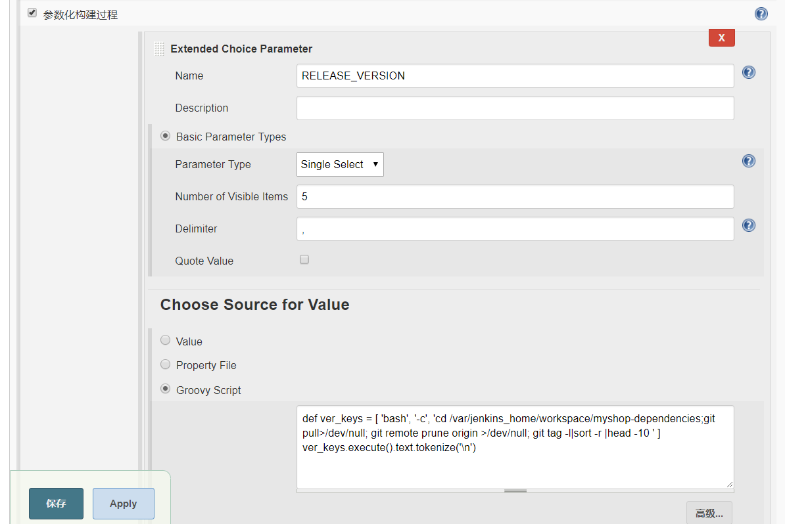

这里使用了 Groovy 脚本来查询最近的 tags 版本，代码如下：

```text
def ver_keys = [ 'bash', '-c', 'cd /var/jenkins_home/workspace/myshop-dependencies;git pull>/dev/null; git remote prune origin >/dev/null; git tag -l|sort -r |head -10 ' ]
ver_keys.execute().text.tokenize('\n')
```

- 关闭源码管理


- 增加构建步骤

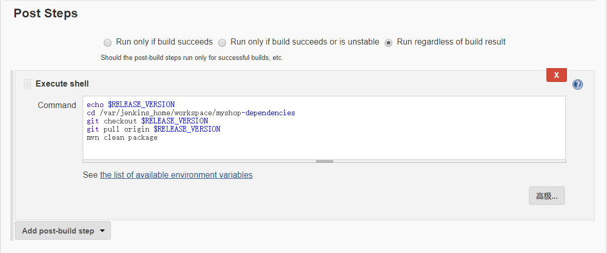

```shell
echo $RELEASE_VERSION
cd /var/jenkins_home/workspace/myshop-dependencies
git checkout $RELEASE_VERSION
git pull origin $RELEASE_VERSION
mvn clean package
```

- 使用参数化构建项目

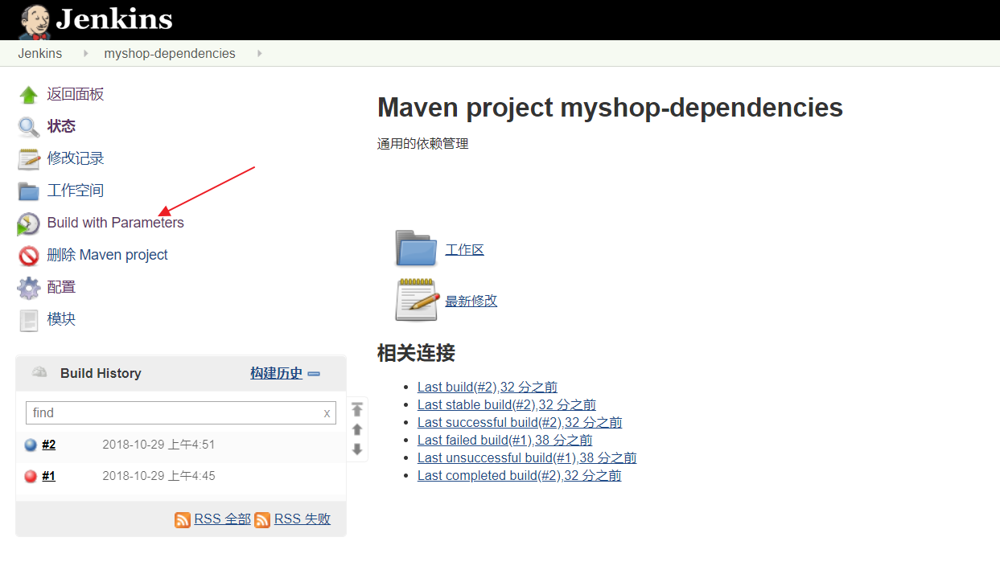

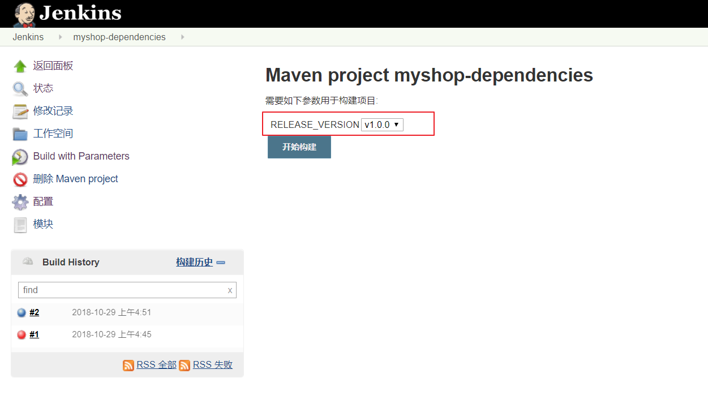

- 查看构建日志


## 持续交付用户服务提供者

在 Jenkins 中创建一个基于 Maven 的任务

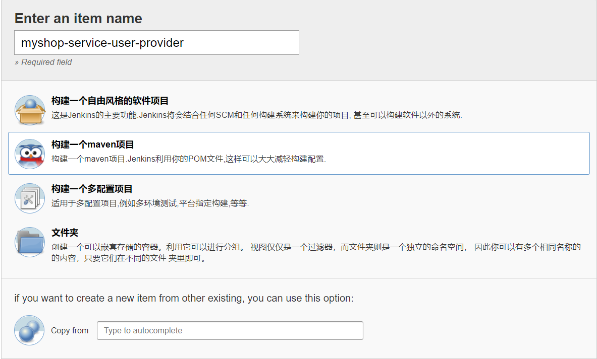

### 配置 Maven Project

#### 配置第一次构建


- 构建项目


- 查看构建日志


#### 配置正式构建

- 增加参数化构建过程


这里使用了 Groovy 脚本来查询最近的 tags 版本，代码如下：

```text
def ver_keys = [ 'bash', '-c', 'cd /var/jenkins_home/workspace/myshop-service-user-provider;git pull>/dev/null; git remote prune origin >/dev/null; git tag -l|sort -r |head -10 ' ]
ver_keys.execute().text.tokenize('\n')
```

- 关闭源码管理


- 增加构建步骤

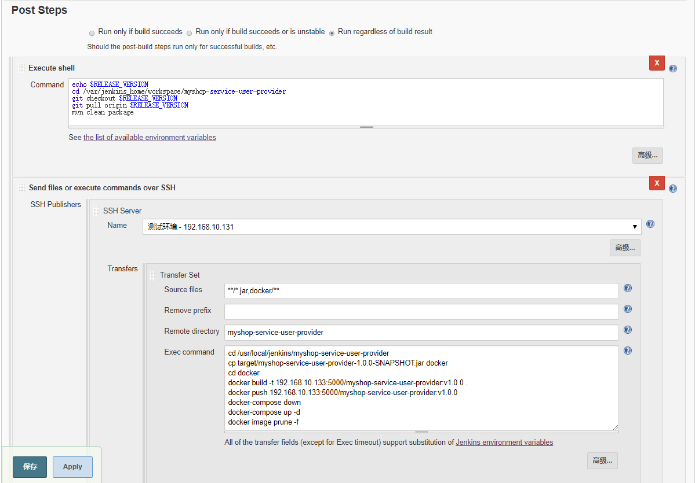

- Execute Shell（本地执行 Shell 脚本）

```sh
echo $RELEASE_VERSION
cd /var/jenkins_home/workspace/myshop-service-user-provider
git checkout $RELEASE_VERSION
git pull origin $RELEASE_VERSION
mvn clean package
```

- Send files or execute commands over SSH（发送文件或执行远程命令）

  - Source files：需要传输到远程目标服务器的文件

  ```text
  `**/*.jar,docker/**`
  ```

  - Remove prefix：删除前缀。比如传输 `**/*.jar`，我们打包的 `.jar` 文件是在 `target` 目录下的，传输时会一并创建 `target` 目录，如果不希望创建 `target` 目录，则可以使用该参数屏蔽掉这些前缀文件夹。
  - Remote directory：在远程目标服务器创建操作目录

  ```text
  myshop-service-user-provider
  ```

  - Exec command：在远程目标服务器执行控制台命令

  ```sh
  cd /usr/local/jenkins/myshop-service-user-provider
  cp target/myshop-service-user-provider-1.0.0-SNAPSHOT.jar docker
  cd docker
  docker build -t 192.168.10.133:5000/myshop-service-user-provider:v1.0.0 .
  docker push 192.168.10.133:5000/myshop-service-user-provider:v1.0.0
  docker-compose down
  docker-compose up -d
  docker image prune -f
  ```

- 使用参数化构建项目

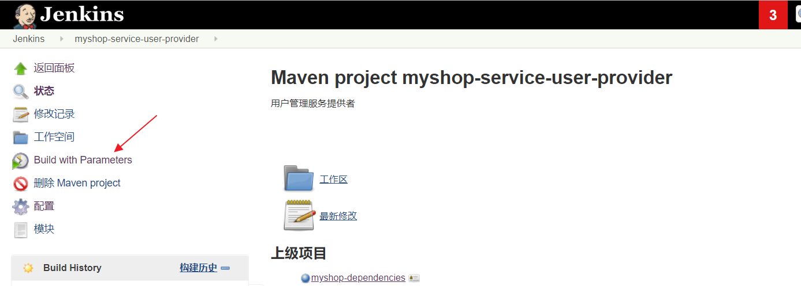

- 查看构建日志


## 持续交付用户服务消费者

操作步骤同上