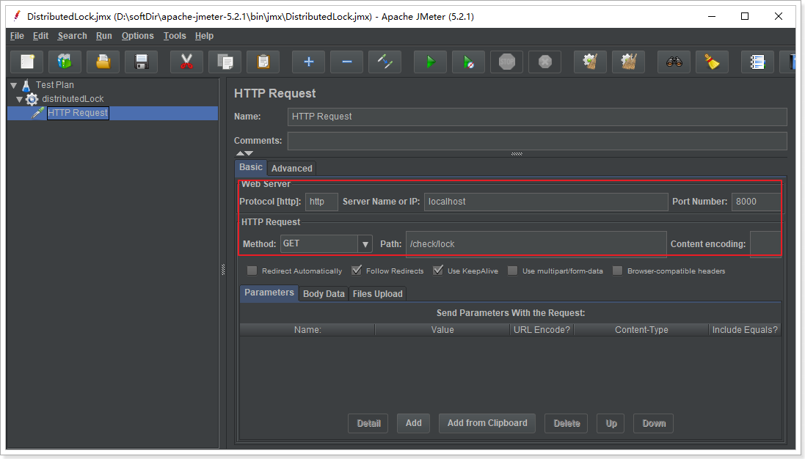
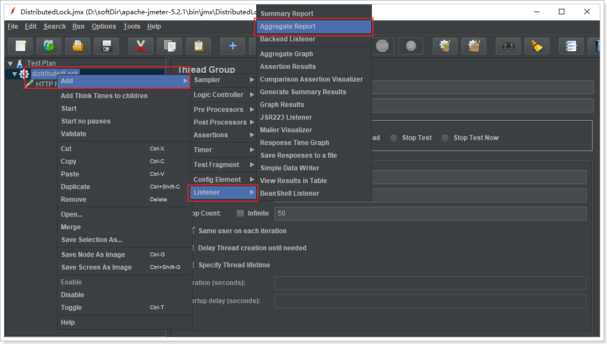

# 传统锁回顾

## 从减库存开始

多线程并发安全问题最典型的代表就是超卖现象。库存在并发量较大情况下很容易发生超卖现象，一旦发生超卖现象，就会出现多成交了订单而发不了货的情况。

> 商品S库存余量为5时，用户A和B同时来购买一个商品，此时查询库存数都为5，库存充足则开始减库存：
>
> 用户A：update db_stock set stock = stock - 1 where id = 1
>
> 用户B：update db_stock set stock = stock - 1 where id = 1
>
> 并发情况下，更新后的结果可能是4，而实际的最终库存量应该是3才对。
>

## 准备

### 建表

~~~sql
CREATE TABLE `db_stock` (
  `id` bigint(20) NOT NULL AUTO_INCREMENT,
  `product_code` varchar(255) DEFAULT NULL COMMENT '商品编号',
  `stock_code` varchar(255) DEFAULT NULL COMMENT '仓库编号',
  `count` int(11) DEFAULT NULL COMMENT '库存量',
  PRIMARY KEY (`id`)
) ENGINE=InnoDB AUTO_INCREMENT=1 DEFAULT CHARSET=utf8mb4;
~~~

### 创建项目

pom.xml

~~~xml
<?xml version="1.0" encoding="UTF-8"?>
<project xmlns:xsi="http://www.w3.org/2001/XMLSchema-instance" xmlns="http://maven.apache.org/POM/4.0.0"
         xsi:schemaLocation="http://maven.apache.org/POM/4.0.0 https://maven.apache.org/xsd/maven-4.0.0.xsd">
    <modelVersion>4.0.0</modelVersion>
    <parent>
        <groupId>org.springframework.boot</groupId>
        <artifactId>spring-boot-starter-parent</artifactId>
        <version>2.7.6</version>
        <relativePath/> <!-- lookup parent from repository -->
    </parent>
    <groupId>com.lock</groupId>
    <artifactId>distributed-lock</artifactId>
    <version>0.0.1-SNAPSHOT</version>
    <name>distributed-lock</name>
    <description>distributed-lock</description>
    <properties>
        <java.version>8</java.version>
    </properties>
    <dependencies>
        <dependency>
            <groupId>org.springframework.boot</groupId>
            <artifactId>spring-boot-starter-web</artifactId>
        </dependency>

        <dependency>
            <groupId>org.springframework.boot</groupId>
            <artifactId>spring-boot-starter-test</artifactId>
            <scope>test</scope>
        </dependency>

        <dependency>
            <groupId>org.projectlombok</groupId>
            <artifactId>lombok</artifactId>
            <optional>true</optional>
        </dependency>

        <dependency>
            <groupId>mysql</groupId>
            <artifactId>mysql-connector-java</artifactId>
            <version>8.0.30</version>
        </dependency>

        <dependency>
            <groupId>com.baomidou</groupId>
            <artifactId>mybatis-plus-boot-starter</artifactId>
            <version>3.5.2</version>
        </dependency>
    </dependencies>

    <build>
        <plugins>
            <plugin>
                <groupId>org.springframework.boot</groupId>
                <artifactId>spring-boot-maven-plugin</artifactId>
                <configuration>
                    <excludes>
                        <exclude>
                            <groupId>org.projectlombok</groupId>
                            <artifactId>lombok</artifactId>
                        </exclude>
                    </excludes>
                </configuration>
            </plugin>
        </plugins>
    </build>

</project>
~~~

~~~yaml
mybatis-plus:
#  configuration:
#    log-impl: org.apache.ibatis.logging.stdout.StdOutImpl
  mapper-locations: classpath:mapper/*.xml
spring:
  datasource:
    type: com.zaxxer.hikari.HikariDataSource
    driver-class-name: com.mysql.cj.jdbc.Driver
    url: jdbc:mysql://192.168.25.10:3306/lock?characterEncoding=utf8&zeroDateTimeBehavior=convertToNull&useSSL=false&serverTimezone=Asia/Shanghai
    username: root
    password: 111111
  jackson:
    date-format: yyyy-MM-dd HH:mm:ss
    time-zone: GMT+8

server:
  port: 8888
~~~

Pojo

~~~java
@Data
@AllArgsConstructor
@NoArgsConstructor
@TableName(value = "db_stock")
public class Stock {
    @TableId(value = "id", type = IdType.AUTO)
    private Long id;

    /**
     * 商品编号
     */
    @TableField(value = "product_code")
    private String productCode;

    /**
     * 仓库编号
     */
    @TableField(value = "stock_code")
    private String stockCode;

    /**
     * 库存量
     */
    @TableField(value = "`count`")
    private Integer count;

    public static final String COL_ID = "id";

    public static final String COL_PRODUCT_CODE = "product_code";

    public static final String COL_STOCK_CODE = "stock_code";

    public static final String COL_COUNT = "count";
}
~~~

Mapper

~~~java
@Mapper
public interface StockMapper extends BaseMapper<Stock> {
}
~~~

Service

~~~java
@Service
@Slf4j
public class StockServiceImpl extends ServiceImpl<StockMapper, Stock> implements StockService {
    @Autowired
    private StockMapper stockMapper;

    @Override
    public void deduct() {
        Stock stock = stockMapper.selectOne(new QueryWrapper<Stock>().eq(Stock.COL_PRODUCT_CODE, "1001"));
        if (null != stock && stock.getCount() > 0) {
            stock.setCount(stock.getCount() - 1);
            updateById(stock);
        }
    }
}
~~~

Controller

~~~java
@RestController
public class StockController {

    @Autowired
    private StockService stockService;

    @GetMapping("stock/deduct")
    public String deduct(){
        this.stockService.deduct();
        return "hello stock deduct！！";
    }
}
~~~

## 演示超卖现象

接下来咱们使用jmeter压力测试工具，高并发下压测一下，添加线程组：并发100循环50次，即5000次请求。

给线程组添加HTTP Request请求：

填写测试接口路径如下：

再选择你想要的测试报表，例如这里选择聚合报告：

启动测试，查看压力测试报告：

- Label          取样器别名，如果勾选**Include group name** ，则会添加线程组的名称作为前缀
- \# Samples      取样器运行次数
- Average       请求（事务）的平均响应时间
- Median        中位数
- 90% Line       90%用户响应时间
- 95% Line       90%用户响应时间
- 99% Line       90%用户响应时间
- Min           最小响应时间
- Max           最大响应时间
- Error          错误率
- Throughput     吞吐率
- Received KB/sec  每秒收到的千字节
- Sent KB/sec      每秒收到的千字节

测试结果：请求总数5000次，平均请求时间37ms，中位数（50%）请求是在36ms内完成的，错误率0%，每秒钟平均吞吐量2568.1次。

查看mysql数据库剩余库存数：还有4870

此时如果还有人来下单，就会出现超卖现象（别人购买成功，而无货可发）。

## 问题演示

### 添加 jvm 锁

修改service

~~~java
//加上synchronized修饰符
public synchronized void deduct() {
    Stock stock = stockMapper.selectOne(new QueryWrapper<Stock>().eq(Stock.COL_PRODUCT_CODE, "1001"));
    if (null != stock && stock.getCount() > 0) {
        stock.setCount(stock.getCount() - 1);
        updateById(stock);
    }
}
~~~

查看MySql，发现完美解决了。

**原理**

添加synchronized关键字之后，StockService就具备了对象锁，由于添加了独占的排他锁，同一时刻只有一个请求能够获取到锁，并减库存。此时，所有请求只会one-by-one执行下去，也就不会发生超卖现象。

### 添加 juc 锁

~~~java
@Service
@Slf4j
public class StockServiceImpl extends ServiceImpl<StockMapper, Stock> implements StockService {
    @Autowired
    private StockMapper stockMapper;

    private ReentrantLock lock = new ReentrantLock();

    @Override
    public void deduct() {
        lock.lock();
        try {
            Stock stock = stockMapper.selectOne(new QueryWrapper<Stock>().eq(Stock.COL_PRODUCT_CODE, "1001"));
            if (null != stock && stock.getCount() > 0) {
                stock.setCount(stock.getCount() - 1);
//                log.info("剩余：" + stock.getCount());
                updateById(stock);
            }
        } catch (Exception e) {
            e.printStackTrace();
        } finally {
            lock.unlock();
        }
    }
}
~~~

原来和上述synchronized一致。

## 多服务问题

但是上述的锁仅在单例模式或者但应用部署的时候才有效。

### 多例模式

~~~java
@Service
@Scope(value = "prototype", proxyMode = ScopedProxyMode.TARGET_CLASS)
@Slf4j
public class StockServiceImpl extends ServiceImpl<StockMapper, Stock> implements StockService {
    @Autowired
    private StockMapper stockMapper;

    private ReentrantLock lock = new ReentrantLock();

    @Override
    public void deduct() {
        lock.lock();
        try {
            Stock stock = stockMapper.selectOne(new QueryWrapper<Stock>().eq(Stock.COL_PRODUCT_CODE, "1001"));
            if (null != stock && stock.getCount() > 0) {
                stock.setCount(stock.getCount() - 1);
//                log.info("剩余：" + stock.getCount());
                updateById(stock);
            }
        } catch (Exception e) {
            e.printStackTrace();
        } finally {
            lock.unlock();
        }
    }
}
~~~

执行 Jmeter 发现库存还剩下4904，明显不对。因为ReentrantLock和非静态方法的上synchronized都只是对当前实例有效。每次请求都会创建一个新的deduct()。

### 多服务模式

