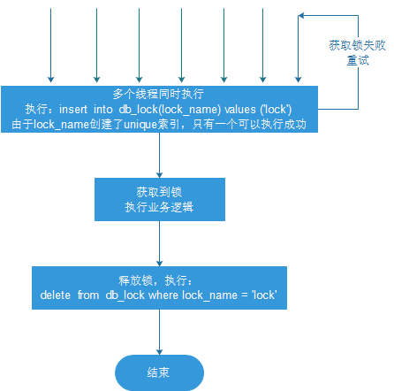

# 基于 MySQL 实现分布式锁

不管是jvm锁还是mysql锁，为了保证线程的并发安全，都提供了悲观**独占排他锁**。所以独占排他也是分布式锁的基本要求。

可以利用**唯一键索引**不能重复插入的特点实现。设计表如下：

~~~sql
CREATE TABLE `db_lock` (
  `id` bigint NOT NULL AUTO_INCREMENT,
  `lock_name` varchar(50) NOT NULL COMMENT '锁名',
  `class_name` varchar(100) DEFAULT NULL COMMENT '类名',
  `method_name` varchar(50) DEFAULT NULL COMMENT '方法名',
  `server_name` varchar(50) DEFAULT NULL COMMENT '服务器ip',
  `thread_name` varchar(50) DEFAULT NULL COMMENT '线程名',
  `create_time` timestamp NULL DEFAULT NULL ON UPDATE CURRENT_TIMESTAMP COMMENT '获取锁时间',
  `desc` varchar(100) DEFAULT NULL COMMENT '描述',
  PRIMARY KEY (`id`),
  UNIQUE KEY `idx_unique` (`lock_name`)
) ENGINE=InnoDB DEFAULT CHARSET=utf8mb4 COLLATE=utf8mb4_0900_ai_ci;
~~~

## 基本思路

1. 线程同时获取锁（insert）
2. 获取成功，执行业务逻辑，执行完成释放锁（delete）
3. 其他线程等待重试

~~~java

@Transactional // 加事务保证原子性
@Override
public void deduct() {
    /**
         * 数据库分布式锁
         */

    // 加锁
    Lock lock = new Lock(null, "lock", this.getClass().getName(), Thread.currentThread().getStackTrace()[1].getMethodName(), ServletUtil.getClientIP(request), Thread.currentThread().getName(), new Date(), null);
    try {
        this.lockMapper.insert(lock);
    } catch (Exception ex) {
        // 获取锁失败，则重试
        try {
            Thread.sleep(100);
            this.deduct();
        } catch (InterruptedException e) {
            e.printStackTrace();
        }
    }

    // 先查询库存是否充足
    Stock stock = this.stockMapper.selectById(1L);

    // 再减库存
    if (stock != null && stock.getCount() > 0) {

        stock.setCount(stock.getCount() - 1);
        this.stockMapper.updateById(stock);
    }

    // 释放锁
    this.lockMapper.deleteById(lock.getId());
}
~~~

## 缺陷及解决方案

**缺点**：

   1. 这把锁强依赖数据库的可用性，数据库是一个单点，一旦数据库挂掉，会导致业务系统不可用。

      解决方案：给 锁数据库 搭建主备

   2. 这把锁没有失效时间，一旦解锁操作失败，就会导致锁记录一直在数据库中，其他线程无法再获得到锁。

      解决方案：只要做一个定时任务，每隔一定时间把数据库中的超时数据清理一遍。

   3. 这把锁是非重入的，同一个线程在没有释放锁之前无法再次获得该锁。因为数据中数据已经存在了。

      解决方案：记录获取锁的主机信息和线程信息，如果相同线程要获取锁，直接重入。

   4. 受制于数据库性能，并发能力有限。

      解决方案：无法解决。

