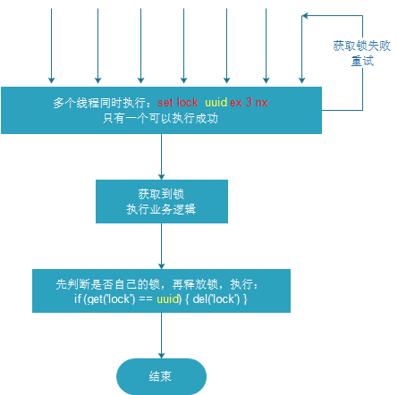

# 基于 Redis 实现分布式锁

## 演示超卖现象

首先需要将maven依赖添加到项目中

~~~xml
<dependency>
    <groupId>org.springframework.boot</groupId>
    <artifactId>spring-boot-starter-data-redis</artifactId>
</dependency>
~~~

然后在application文件中配置Redis相关信息，因为我使用的Sentinel。

~~~yaml
mybatis-plus:
  mapper-locations: classpath:mapper/*.xml
spring:
  datasource:
    type: com.zaxxer.hikari.HikariDataSource
    driver-class-name: com.mysql.cj.jdbc.Driver
    url: jdbc:mysql://192.168.25.10:3306/lock?characterEncoding=utf8&zeroDateTimeBehavior=convertToNull&useSSL=false&serverTimezone=Asia/Shanghai
    username: root
    password: 111111
  jackson:
    date-format: yyyy-MM-dd HH:mm:ss
    time-zone: GMT+8
  redis:
    sentinel:
      master: mymaster
      nodes:
        - 192.168.25.10:26379
        - 192.168.25.10:26380
        - 192.168.25.10:26381
      password: 111111
     # 必须配置Redis的密码，否则会抛出连接Redis失败的异常。
    password: 111111
server:
  port: 8888
~~~

~~~java
@Service
@Slf4j
public class StockServiceImpl extends ServiceImpl<StockMapper, Stock> implements StockService {

    @Autowired
    private StringRedisTemplate redisTemplate;

    @Override
    public void deduct() {
        String stock = redisTemplate.opsForValue().get("stock");
        if (stock != null && !stock.equals("")) {
            int res = Integer.parseInt(stock);
            if (res > 0) {
                //扣减库存
                redisTemplate.opsForValue().set("stock", String.valueOf(--res));
            }
        }
    }
}
~~~


可以看到吞吐量非常的高。但是出现了超卖现象。

## 解决方案

可以用上一章所学的乐观锁的方式解决Redis的超卖。

[**Redis 乐观锁**](/redis/Redis%20事务—锁机制.html#乐观锁)

~~~java
@Service
@Slf4j
public class StockServiceImpl extends ServiceImpl<StockMapper, Stock> implements StockService {
    @Autowired
    private StockMapper stockMapper;
    @Autowired
    private StringRedisTemplate redisTemplate;

    @Override
    public void deduct() {
        redisTemplate.execute(new SessionCallback<Object>() {
            //operations 指代的就是RedisTemplate 对象
            public Object execute(RedisOperations operations) throws DataAccessException {
                operations.watch("stock");
                String stock = operations.opsForValue().get("stock").toString();
                if (stock != null && !stock.equals("")) {
                    int res = Integer.parseInt(stock);
                    if (res > 0) {
                        operations.multi();
                        //扣减库存
                        operations.opsForValue().set("stock", String.valueOf(--res));
                        List exec = operations.exec();
                        if (null == exec || 0 == exec.size()) {
                            try {
                                TimeUnit.MILLISECONDS.sleep(50);
                                deduct();
                            } catch (InterruptedException e) {
                                throw new RuntimeException(e);
                            }
                        }
                        return exec;
                    }
                }
                return null;
            }
        });
    }
}
~~~


超卖问题得以解决，但是吞吐量下降明显。这种方式**不推荐使用**。

## Redis 分布式锁

### 基本实现

借助于redis中的命令setnx(key, value)，key不存在就新增，存在就什么都不做。同时有多个客户端发送setnx命令，只有一个客户端可以成功，返回1（true）；其他的客户端返回0（false）。


1. 多个客户端同时获取锁（setnx）。
2. 获取成功，执行业务逻辑，执行完成释放锁（del）。
3. 其他客户端等待重试。

~~~java
@Service
@Slf4j
public class StockServiceImpl extends ServiceImpl<StockMapper, Stock> implements StockService {
    @Autowired
    private StockMapper stockMapper;
    @Autowired
    private StringRedisTemplate redisTemplate;

    @Override
    public void deduct() {
        // 加锁
        Boolean lock = redisTemplate.opsForValue().setIfAbsent("deduct:lock", UUID.randomUUID().toString());
        // 重试调用
        if (Boolean.FALSE.equals(lock)) {
            try {
                TimeUnit.MILLISECONDS.sleep(50);
            } catch (InterruptedException e) {
                throw new RuntimeException(e);
            }
            deduct();
        } else {
            try {
                String stock = redisTemplate.opsForValue().get("stock").toString();
                if (stock != null && !stock.equals("")) {
                    int res = Integer.parseInt(stock);
                    if (res > 0) {
                        //扣减库存
                        redisTemplate.opsForValue().set("stock", String.valueOf(--res));
                    }
                }
            } finally {
                //解锁
                redisTemplate.delete("deduct:lock");
            }
        }
    }
}
~~~

~~~java
@Service
@Slf4j
public class StockServiceImpl extends ServiceImpl<StockMapper, Stock> implements StockService {
    @Autowired
    private StockMapper stockMapper;
    @Autowired
    private StringRedisTemplate redisTemplate;

    @Override
    public void deduct() {
        // 也可以替换成while循环
        while (Boolean.FALSE.equals(redisTemplate.opsForValue().setIfAbsent("deduct:lock", UUID.randomUUID().toString()))) {
            try {
                TimeUnit.MILLISECONDS.sleep(50);
            } catch (InterruptedException e) {
                throw new RuntimeException(e);
            }
        }
        try {
            String stock = Objects.requireNonNull(redisTemplate.opsForValue().get("stock"));
            if (!stock.equals("")) {
                int res = Integer.parseInt(stock);
                if (res > 0) {
                    //扣减库存
                    redisTemplate.opsForValue().set("stock", String.valueOf(--res));
                }
            }
        } finally {
            //解锁
            redisTemplate.delete("deduct:lock");
        }
    }
}
~~~


<font color="red">出现问题：会出现死锁。</font>

### 防死锁

**问题**：setnx刚刚获取到锁，当前服务器宕机，导致del释放锁无法执行，进而导致锁无法锁无法释放（死锁）。

**解决**：给锁设置过期时间，自动释放锁。

设置过期时间两种方式：

* 通过expire设置过期时间（缺乏原子性：如果在setnx和expire之间出现异常，锁也无法释放）。
* 使用set指令设置过期时间：`set key value ex 3 nx`（既达到setnx的效果，又设置了过期时间）。

~~~java
while (Boolean.FALSE.equals(redisTemplate.opsForValue().setIfAbsent("deduct:lock", UUID.randomUUID().toString(),5,TimeUnit.SECONDS)))
~~~

<font color="red">出现问题：会删除其他线程的锁。</font>

### 防误删

**问题**：可能会释放其他服务器的锁。

**场景**：如果业务逻辑的执行时间是7s。执行流程如下

1. index1业务逻辑没执行完，3秒后锁被自动释放。

2. index2获取到锁，执行业务逻辑，3秒后锁被自动释放。

3. index3获取到锁，执行业务逻辑。

4. index1业务逻辑执行完成，开始调用del释放锁，这时释放的是index3的锁，导致index3的业务只执行1s就被别人释放。

**解决**：setnx获取锁时，设置一个指定的唯一值（例如：uuid）；释放前获取这个值，判断是否自己的锁。



<font color="red">出现问题：删除缺乏原子性。</font>

**场景**：

1. index1执行删除时，查询到的lock值确实和uuid相等。
2. index1执行删除前，lock刚好过期时间已到，被redis自动释放。
3. index2获取了lock。
4. index1执行删除，此时会把index2的lock删除。

**解决方案**：没有一个命令可以同时做到判断 + 删除，所有只能通过其他方式实现（**LUA脚本**）。

## Redis 中的 lua 脚本

### 现实问题

redis采用单线程架构，可以保证单个命令的原子性，但是无法保证一组命令在高并发场景下的原子性。例如：


在串行场景下：A和B的值肯定都是3。

在并发场景下：A和B的值可能在0-6之间。

**极限情况下1**：


则A的结果是0，B的结果是3。

**极限情况下2**：


则A和B的结果都是6


### Lua 介绍

Lua 是一种轻量小巧的脚本语言，用标准C语言编写并以源代码形式开放， 其设计目的是为了嵌入应用程序中，从而为应用程序提供灵活的扩展和定制功能。

**设计目的**

​	其设计目的是为了嵌入应用程序中，从而为应用程序提供灵活的扩展和定制功能。

**Lua 特性**

- **轻量级**：它用标准C语言编写并以源代码形式开放，编译后仅仅一百余K，可以很方便的嵌入别的程序里。
- **可扩展**：Lua提供了非常易于使用的扩展接口和机制：由宿主语言(通常是C或C++)提供这些功能，Lua可以使用它们，就像是本来就内置的功能一样。
- 其它特性：
  - 支持面向过程(procedure-oriented)编程和函数式编程(functional programming)；
  - 自动内存管理；只提供了一种通用类型的表（table），用它可以实现数组，哈希表，集合，对象；
  - 语言内置模式匹配；闭包(closure)；函数也可以看做一个值；提供多线程（协同进程，并非操作系统所支持的线程）支持；
  - 通过闭包和table可以很方便地支持面向对象编程所需要的一些关键机制，比如数据抽象，虚函数，继承和重载等。

### Lua 基本语法

对lua脚本感兴趣的同学，请移步到官方教程或者《菜鸟教程》。这里仅以redis中可能会用到的部分语法作介绍。

```lua
a = 5               -- 全局变量
local b = 5         -- 局部变量， redis只支持局部变量
a, b = 10, 2*x      -- 等价于       a=10; b=2*x
```

流程控制：

```lua
if( 布尔表达式 1)
then
   --[ 在布尔表达式 1 为 true 时执行该语句块 --]
elseif( 布尔表达式 2)
then
   --[ 在布尔表达式 2 为 true 时执行该语句块 --]
else 
   --[ 如果以上布尔表达式都不为 true 则执行该语句块 --]
end
```

### Redis 执行 Lua 脚本

在redis中需要通过eval命令执行lua脚本。

格式：

```lua
EVAL script numkeys key [key ...] arg [arg ...]
script：lua脚本字符串，这段Lua脚本不需要（也不应该）定义函数。
numkeys：lua脚本中KEYS数组的大小
key [key ...]：KEYS数组中的元素
arg [arg ...]：ARGV数组中的元素
```

**案例1**：基本案例

```shell
EVAL "return 10" 0
```

输出：(integer) 10

**案例2**：动态传参

```shell
EVAL "return {KEYS[1],KEYS[2],ARGV[1],ARGV[2]}" 5 10 20 30 40 50 60 70 80 90
# 输出：10 20 60 70
# 5 值得是KEY的个数，那么10 20 30 40 50 都是 KEY ，而 60 70 80 90 为 ARG

EVAL "if KEYS[1] > ARGV[1] then return 1 else return 0 end" 1 10 20
# 输出：0

EVAL "if KEYS[1] > ARGV[1] then return 1 else return 0 end" 1 20 10
# 输出：1
```

~~传入了两个参数10和20，KEYS的长度是1，所以KEYS中有一个元素10，剩余的一个20就是ARGV数组的元素。

**案例3**：执行redis类库方法

redis.call()中的redis是redis中提供的lua脚本类库，仅在redis环境中可以使用该类库。

```shell
set aaa 10  -- 设置一个aaa值为10
EVAL "return redis.call('get', 'aaa')" 0
# 通过return把call方法返回给redis客户端，打印："10"
```

注意：**脚本里使用的所有键都应该由 KEYS 数组来传递。**但并不是强制性的，代价是这样写出的脚本不能被 Redis 集群所兼容。

**案例4**：给redis类库方法动态传参

```shell
EVAL "return redis.call('set', KEYS[1], ARGV[1])" 1 bbb 20
```


**案例5**：pcall函数的使用

~~~shell
-- 当call() 在执行命令的过程中发生错误时，脚本会停止执行，并返回一个脚本错误，输出错误信息
EVAL "return redis.call('sets', KEYS[1], ARGV[1]), redis.call('set', KEYS[2], ARGV[2])" 2 bbb ccc 20 30
-- pcall函数不影响后续指令的执行
EVAL "return redis.pcall('sets', KEYS[1], ARGV[1]), redis.pcall('set', KEYS[2], ARGV[2])" 2 bbb ccc 20 30
~~~

