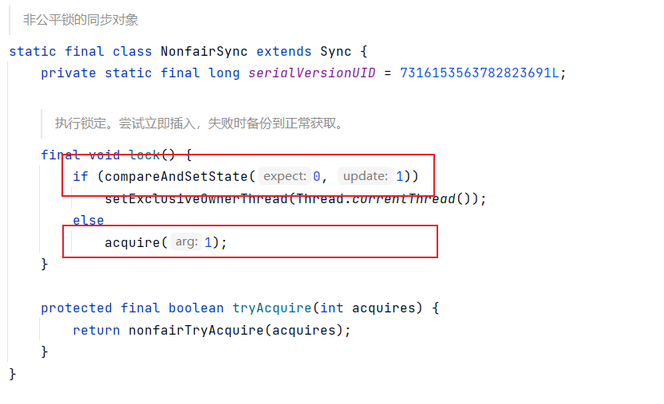
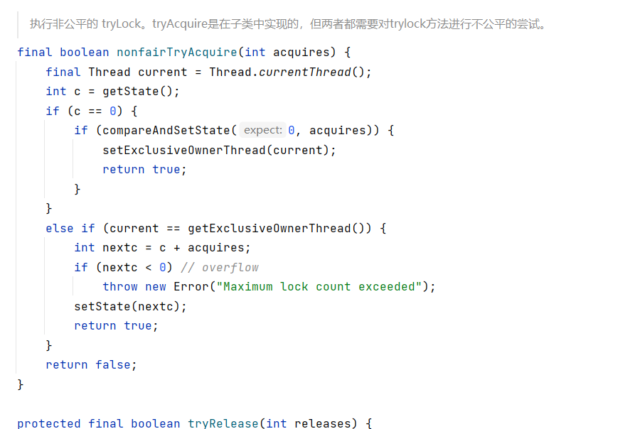
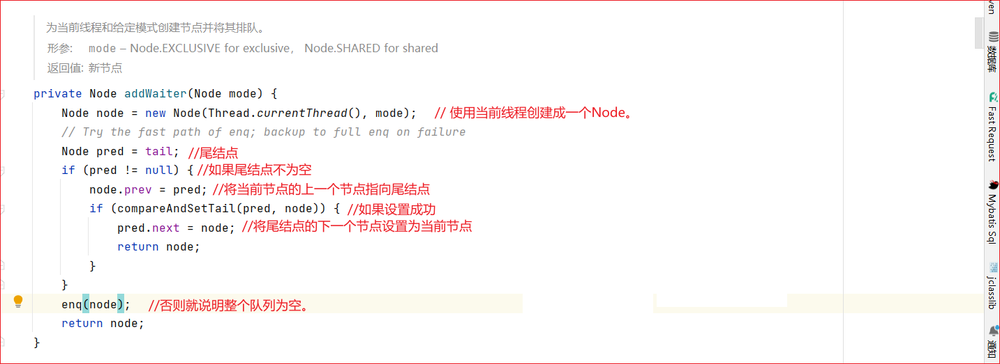
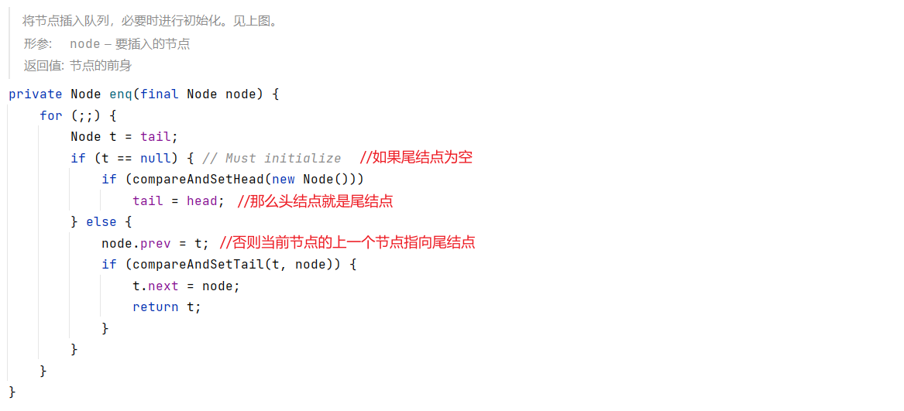
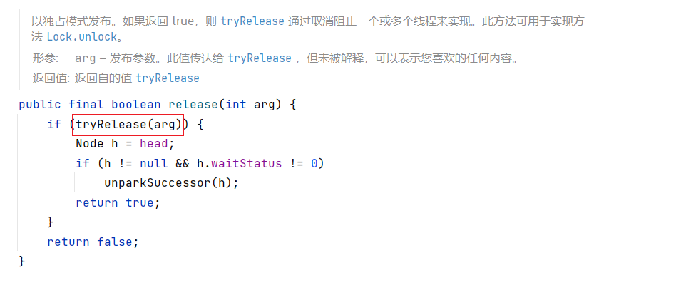
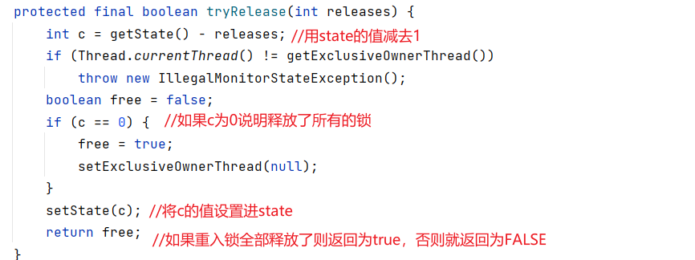
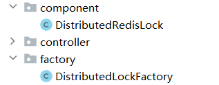
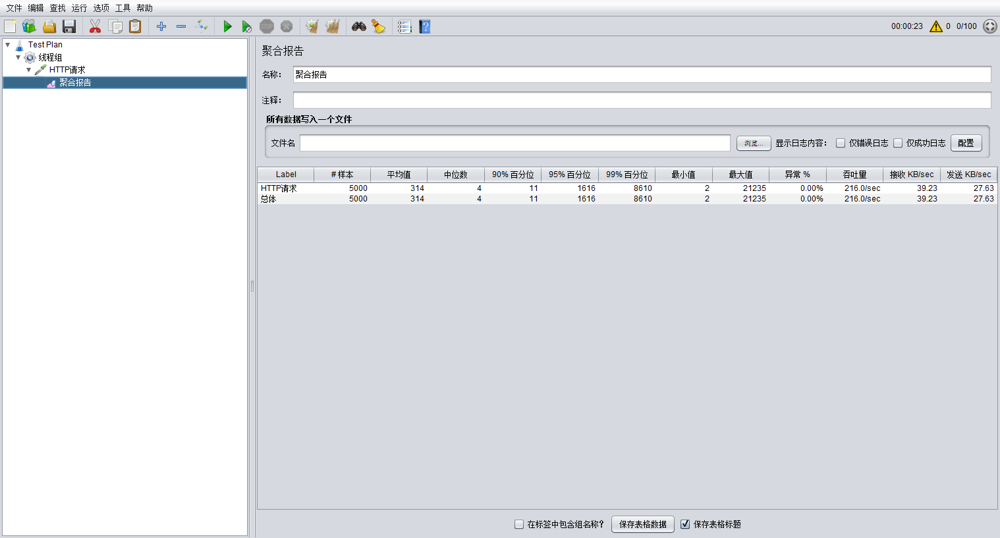

# 基于 Redis 实现分布式锁

## 演示超卖现象

首先需要将maven依赖添加到项目中

~~~xml
<dependency>
    <groupId>org.springframework.boot</groupId>
    <artifactId>spring-boot-starter-data-redis</artifactId>
</dependency>
~~~

然后在application文件中配置Redis相关信息，因为我使用的Sentinel。

~~~yaml
mybatis-plus:
  mapper-locations: classpath:mapper/*.xml
spring:
  datasource:
    type: com.zaxxer.hikari.HikariDataSource
    driver-class-name: com.mysql.cj.jdbc.Driver
    url: jdbc:mysql://192.168.25.10:3306/lock?characterEncoding=utf8&zeroDateTimeBehavior=convertToNull&useSSL=false&serverTimezone=Asia/Shanghai
    username: root
    password: 111111
  jackson:
    date-format: yyyy-MM-dd HH:mm:ss
    time-zone: GMT+8
  redis:
    sentinel:
      master: mymaster
      nodes:
        - 192.168.25.10:26379
        - 192.168.25.10:26380
        - 192.168.25.10:26381
      password: 111111
     # 必须配置Redis的密码，否则会抛出连接Redis失败的异常。
    password: 111111
server:
  port: 8888
~~~

~~~java
@Service
@Slf4j
public class StockServiceImpl extends ServiceImpl<StockMapper, Stock> implements StockService {

    @Autowired
    private StringRedisTemplate redisTemplate;

    @Override
    public void deduct() {
        String stock = redisTemplate.opsForValue().get("stock");
        if (stock != null && !stock.equals("")) {
            int res = Integer.parseInt(stock);
            if (res > 0) {
                //扣减库存
                redisTemplate.opsForValue().set("stock", String.valueOf(--res));
            }
        }
    }
}
~~~


可以看到吞吐量非常的高。但是出现了超卖现象。

## 解决方案

可以用上一章所学的乐观锁的方式解决Redis的超卖。

[**Redis 乐观锁**](/redis/Redis%20事务—锁机制.html#乐观锁)

~~~java
@Service
@Slf4j
public class StockServiceImpl extends ServiceImpl<StockMapper, Stock> implements StockService {
    @Autowired
    private StockMapper stockMapper;
    @Autowired
    private StringRedisTemplate redisTemplate;

    @Override
    public void deduct() {
        redisTemplate.execute(new SessionCallback<Object>() {
            //operations 指代的就是RedisTemplate 对象
            public Object execute(RedisOperations operations) throws DataAccessException {
                operations.watch("stock");
                String stock = operations.opsForValue().get("stock").toString();
                if (stock != null && !stock.equals("")) {
                    int res = Integer.parseInt(stock);
                    if (res > 0) {
                        operations.multi();
                        //扣减库存
                        operations.opsForValue().set("stock", String.valueOf(--res));
                        List exec = operations.exec();
                        if (null == exec || 0 == exec.size()) {
                            try {
                                TimeUnit.MILLISECONDS.sleep(50);
                                deduct();
                            } catch (InterruptedException e) {
                                throw new RuntimeException(e);
                            }
                        }
                        return exec;
                    }
                }
                return null;
            }
        });
    }
}
~~~


超卖问题得以解决，但是吞吐量下降明显。这种方式**不推荐使用**。

## Redis 分布式锁

### 基本实现

借助于redis中的命令setnx(key, value)，key不存在就新增，存在就什么都不做。同时有多个客户端发送setnx命令，只有一个客户端可以成功，返回1（true）；其他的客户端返回0（false）。


1. 多个客户端同时获取锁（setnx）。
2. 获取成功，执行业务逻辑，执行完成释放锁（del）。
3. 其他客户端等待重试。

~~~java
@Service
@Slf4j
public class StockServiceImpl extends ServiceImpl<StockMapper, Stock> implements StockService {
    @Autowired
    private StockMapper stockMapper;
    @Autowired
    private StringRedisTemplate redisTemplate;

    @Override
    public void deduct() {
        // 加锁
        Boolean lock = redisTemplate.opsForValue().setIfAbsent("deduct:lock", UUID.randomUUID().toString());
        // 重试调用
        if (Boolean.FALSE.equals(lock)) {
            try {
                TimeUnit.MILLISECONDS.sleep(50);
            } catch (InterruptedException e) {
                throw new RuntimeException(e);
            }
            deduct();
        } else {
            try {
                String stock = redisTemplate.opsForValue().get("stock").toString();
                if (stock != null && !stock.equals("")) {
                    int res = Integer.parseInt(stock);
                    if (res > 0) {
                        //扣减库存
                        redisTemplate.opsForValue().set("stock", String.valueOf(--res));
                    }
                }
            } finally {
                //解锁
                redisTemplate.delete("deduct:lock");
            }
        }
    }
}
~~~

~~~java
@Service
@Slf4j
public class StockServiceImpl extends ServiceImpl<StockMapper, Stock> implements StockService {
    @Autowired
    private StockMapper stockMapper;
    @Autowired
    private StringRedisTemplate redisTemplate;

    @Override
    public void deduct() {
        // 也可以替换成while循环
        while (Boolean.FALSE.equals(redisTemplate.opsForValue().setIfAbsent("deduct:lock", UUID.randomUUID().toString()))) {
            try {
                TimeUnit.MILLISECONDS.sleep(50);
            } catch (InterruptedException e) {
                throw new RuntimeException(e);
            }
        }
        try {
            String stock = Objects.requireNonNull(redisTemplate.opsForValue().get("stock"));
            if (!stock.equals("")) {
                int res = Integer.parseInt(stock);
                if (res > 0) {
                    //扣减库存
                    redisTemplate.opsForValue().set("stock", String.valueOf(--res));
                }
            }
        } finally {
            //解锁
            redisTemplate.delete("deduct:lock");
        }
    }
}
~~~


<font color="red">出现问题：会出现死锁。</font>

### 防死锁

**问题**：setnx刚刚获取到锁，当前服务器宕机，导致del释放锁无法执行，进而导致锁无法锁无法释放（死锁）。

**解决**：给锁设置过期时间，自动释放锁。

设置过期时间两种方式：

* 通过expire设置过期时间（缺乏原子性：如果在setnx和expire之间出现异常，锁也无法释放）。
* 使用set指令设置过期时间：`set key value ex 3 nx`（既达到setnx的效果，又设置了过期时间）。

~~~java
while (Boolean.FALSE.equals(redisTemplate.opsForValue().setIfAbsent("deduct:lock", UUID.randomUUID().toString(),5,TimeUnit.SECONDS)))
~~~

<font color="red">出现问题：会删除其他线程的锁。</font>

### 防误删

**问题**：可能会释放其他服务器的锁。

**场景**：如果业务逻辑的执行时间是7s。执行流程如下

1. index1业务逻辑没执行完，3秒后锁被自动释放。

2. index2获取到锁，执行业务逻辑，3秒后锁被自动释放。

3. index3获取到锁，执行业务逻辑。

4. index1业务逻辑执行完成，开始调用del释放锁，这时释放的是index3的锁，导致index3的业务只执行1s就被别人释放。

**解决**：setnx获取锁时，设置一个指定的唯一值（例如：uuid）；释放前获取这个值，判断是否自己的锁。


~~~java
@Override
public void deduct() {
    String uuid = UUID.randomUUID().toString();
    // 也可以替换成while循环
    while (Boolean.FALSE.equals(redisTemplate.opsForValue().setIfAbsent("deduct:lock", uuid, 5, TimeUnit.SECONDS))) {
        try {
            TimeUnit.MILLISECONDS.sleep(50);
        } catch (InterruptedException e) {
            throw new RuntimeException(e);
        }
    }
    try {
        String stock = Objects.requireNonNull(redisTemplate.opsForValue().get("stock"));
        if (!stock.equals("")) {
            int res = Integer.parseInt(stock);
            if (res > 0) {
                //扣减库存
                redisTemplate.opsForValue().set("stock", String.valueOf(--res));
            }
        }
    } finally {
        //先判断是否是自己的锁
        if (Objects.equals(redisTemplate.opsForValue().get("deduct:lock"), uuid)) {
            redisTemplate.delete("deduct:lock");
        }
    }
}
~~~

<font color="red">出现问题：删除缺乏原子性。</font>

**场景**：

1. index1执行删除时，查询到的lock值确实和uuid相等。
2. index1执行删除前，lock刚好过期时间已到，被redis自动释放。
3. index2获取了lock。
4. index1执行删除，此时会把index2的lock删除。

**解决方案**：没有一个命令可以同时做到判断 + 删除，所有只能通过其他方式实现（**LUA脚本**）。

## Redis 中的 lua 脚本

### 现实问题

redis采用单线程架构，可以保证单个命令的原子性，但是无法保证一组命令在高并发场景下的原子性。例如：


在串行场景下：A和B的值肯定都是3。

在并发场景下：A和B的值可能在0-6之间。

**极限情况下1**：


则A的结果是0，B的结果是3。

**极限情况下2**：


则A和B的结果都是6


### Lua 介绍

Lua 是一种轻量小巧的脚本语言，用标准C语言编写并以源代码形式开放， 其设计目的是为了嵌入应用程序中，从而为应用程序提供灵活的扩展和定制功能。

**设计目的**

​	其设计目的是为了嵌入应用程序中，从而为应用程序提供灵活的扩展和定制功能。

**Lua 特性**

- **轻量级**：它用标准C语言编写并以源代码形式开放，编译后仅仅一百余K，可以很方便的嵌入别的程序里。
- **可扩展**：Lua提供了非常易于使用的扩展接口和机制：由宿主语言(通常是C或C++)提供这些功能，Lua可以使用它们，就像是本来就内置的功能一样。
- 其它特性：
  - 支持面向过程(procedure-oriented)编程和函数式编程(functional programming)；
  - 自动内存管理；只提供了一种通用类型的表（table），用它可以实现数组，哈希表，集合，对象；
  - 语言内置模式匹配；闭包(closure)；函数也可以看做一个值；提供多线程（协同进程，并非操作系统所支持的线程）支持；
  - 通过闭包和table可以很方便地支持面向对象编程所需要的一些关键机制，比如数据抽象，虚函数，继承和重载等。

### Lua 基本语法

对lua脚本感兴趣的同学，请移步到官方教程或者《菜鸟教程》。这里仅以redis中可能会用到的部分语法作介绍。

```lua
a = 5               -- 全局变量
local b = 5         -- 局部变量， redis只支持局部变量
a, b = 10, 2*x      -- 等价于       a=10; b=2*x
```

流程控制：

```lua
if( 布尔表达式 1)
then
   --[ 在布尔表达式 1 为 true 时执行该语句块 --]
elseif( 布尔表达式 2)
then
   --[ 在布尔表达式 2 为 true 时执行该语句块 --]
else 
   --[ 如果以上布尔表达式都不为 true 则执行该语句块 --]
end
```

### Redis 执行 Lua 脚本

在redis中需要通过eval命令执行lua脚本。

格式：

```lua
EVAL script numkeys key [key ...] arg [arg ...]
script：lua脚本字符串，这段Lua脚本不需要（也不应该）定义函数。
numkeys：lua脚本中KEYS数组的大小
key [key ...]：KEYS数组中的元素
arg [arg ...]：ARGV数组中的元素
```

**案例1**：基本案例

```shell
EVAL "return 10" 0
```

输出：(integer) 10

**案例2**：动态传参

```shell
EVAL "return {KEYS[1],KEYS[2],ARGV[1],ARGV[2]}" 5 10 20 30 40 50 60 70 80 90
# 输出：10 20 60 70
# 5 值得是KEY的个数，那么10 20 30 40 50 都是 KEY ，而 60 70 80 90 为 ARG

EVAL "if KEYS[1] > ARGV[1] then return 1 else return 0 end" 1 10 20
# 输出：0

EVAL "if KEYS[1] > ARGV[1] then return 1 else return 0 end" 1 20 10
# 输出：1
```

~~传入了两个参数10和20，KEYS的长度是1，所以KEYS中有一个元素10，剩余的一个20就是ARGV数组的元素。

**案例3**：执行redis类库方法

redis.call()中的redis是redis中提供的lua脚本类库，仅在redis环境中可以使用该类库。

```shell
set aaa 10  -- 设置一个aaa值为10
EVAL "return redis.call('get', 'aaa')" 0
# 通过return把call方法返回给redis客户端，打印："10"
```

注意：**脚本里使用的所有键都应该由 KEYS 数组来传递。**但并不是强制性的，代价是这样写出的脚本不能被 Redis 集群所兼容。

**案例4**：给redis类库方法动态传参

```shell
EVAL "return redis.call('set', KEYS[1], ARGV[1])" 1 bbb 20
```


**案例5**：pcall函数的使用

~~~shell
-- 当call() 在执行命令的过程中发生错误时，脚本会停止执行，并返回一个脚本错误，输出错误信息
EVAL "return redis.call('sets', KEYS[1], ARGV[1]), redis.call('set', KEYS[2], ARGV[2])" 2 bbb ccc 20 30
-- pcall函数不影响后续指令的执行
EVAL "return redis.pcall('sets', KEYS[1], ARGV[1]), redis.pcall('set', KEYS[2], ARGV[2])" 2 bbb ccc 20 30
~~~


### 使用 Lua 保证删除原子性

删除脚本：

~~~lua
if redis.call('get', KEYS[1]) == ARGV[1] then return redis.call('del', KEYS[1]) else return 0 end
~~~

代码实现：

~~~java
@Override
public void deduct() {
    String uuid = UUID.randomUUID().toString();
    // 也可以替换成while循环
    while (Boolean.FALSE.equals(redisTemplate.opsForValue().setIfAbsent("deduct:lock", uuid, 5, TimeUnit.SECONDS))) {
        try {
            TimeUnit.MILLISECONDS.sleep(50);
        } catch (InterruptedException e) {
            throw new RuntimeException(e);
        }
    }
    try {
        String stock = Objects.requireNonNull(redisTemplate.opsForValue().get("stock"));
        if (!stock.equals("")) {
            int res = Integer.parseInt(stock);
            if (res > 0) {
                //扣减库存
                redisTemplate.opsForValue().set("stock", String.valueOf(--res));
            }
        }
    } finally {
        //先判断是否是自己的锁
        String script = "if redis.call('get', KEYS[1]) == ARGV[1] then return redis.call('del', KEYS[1]) else return 0 end";
        redisTemplate.execute(new DefaultRedisScript<>(script, Integer.class), Collections.singletonList("deduct:lock"), uuid);
    }
}
~~~

## 可重入锁

由于上述加锁命令使用了 SETNX ，一旦键存在就无法再设置成功，这就导致后续同一线程内继续加锁，将会加锁失败。当一个线程执行一段代码成功获取锁之后，继续执行时，又遇到加锁的子任务代码，可重入性就保证线程能继续执行，而不可重入就是需要等待锁释放之后，再次获取锁成功，才能继续往下执行。

用一段 Java 代码解释可重入：

~~~java
public synchronized void a() {
    b();
}

public synchronized void b() {
    // pass
}
~~~

假设线程 X 在 a 方法获取锁之后，调用 b 方法，如果此时不可重入，线程就必须等待释放，再次争抢锁。但锁明明是被 X 线程拥有，却还需要等待自己释放锁，然后再去抢锁，这看起来就很奇怪，我释放我自己。

可重入性就可以解决这个尴尬的问题，当线程拥有锁之后，往后再遇到加锁方法，直接将加锁次数加 1，然后再执行方法逻辑。退出加锁方法之后，加锁次数再减 1，当加锁次数为 0 时，锁才被真正的释放。

可以看到可重入锁最大特性就是计数，计算加锁的次数。所以当可重入锁需要在分布式环境实现时，我们也就需要统计加锁次数。

### 举个例子 ReentrantLock

ReentrantLock 底层主要利用CAS+AQS队列来实现。它支持公平锁和非公平锁，两者的实现类似。

#### CAS 理解

```text
cas，比较并交换。cas算法的过程是这样的，cas包括有三个值：
 v表示要更新的变量
 e表示预期值，就是旧的值
 n表示新值
更新时，判断只有e的值等于v变量的当前旧值时，才会将n新值赋给v，更新为新值。
否则，则认为已经有其他线程更新过了，则当前线程什么都不操作，最后cas放回当前v变量的真实值。
Java 中调用的是 Unsafe.class 中的 compareAndSwap 方法来实现的，这个是一个底层类，直接调用的硬件。看不到源码。
```

CAS是一种**乐观锁**，它抱着乐观的态度认为自己一定可以成果。当多个线程同时使用CAS操作一个变量时，<font color="red">只有一个会胜出</font>，并成功更新，其余均会失败。失败的线程不会被挂起，仅是被告知失败，并且允许再次尝试，当然也允许失败的线程放弃操作。基于这样的原理， CAS操作即使没有锁，也可以发现其他线程对当前线程的干扰，并进行恰当的处理。

CAS会导致“**ABA问题**”。CAS算法实现一个重要前提需要取出内存中某时刻的数据，而在下时 刻比较并替换，那么在这个时间差类会导致数据的变化。

比如：

> 一个线程one从内存位置V中取出A，这时候另一个线程two也从内存中取出 A，并且 two 进行了一些操作变成了 B,然后 two 又将 V 位置的数据变成 A，这时候线程one进行CAS操 作发现内存中仍然是A，然后one操作成功。

尽管线程one的CAS操作成功，但是不代表这个过程就是没有问题的。

部分乐观锁的实现是通过版本号（version）的方式来解决ABA问题，乐观锁每次在执行数据的修改操作时，都会带上一个版本号，一旦版本号和数据的版本号一致就可以执行修改操作并对版本号执行 +1 操作，否则就执行失败。因为每次操作的版本号都会随之增加，所以不会出现ABA问题，因为版本号只会增加不会减少。

#### AQS 理解

AQS，即 AbstractQueuedSynchronizer, 队列同步器，它是 Java 并发用来构建锁和其他同步组件的基础框架。

AQS 是一个抽象类，主是是以继承的方式使用。AQS 本身是没有实现任何同步接口的，它仅仅只是定义了同步状态的获取和释放的方法来供自定义的同步组件的使用。一般是同步组件的静态内部类，即通过组合的方式使用。

AQS定义了一套多线程访问共享资源的同步器框架，许多同步类实现都依赖于它，如常用ReentrantLock/Semaphore/CountDownLatch它维护了一个volatile int state（代表共享资源）和一个**FIFO**（先进先出）线程等待队列（多线程争用资源被阻塞时会进入此队列）。

#### 源码

**加锁**

通过 lock 获取锁，由于构造方法中创建的是非公平锁的实例。其实调用的是 NonfairSync 中的 lock 方法。


可以看到 NonfairSync 继承了 Sync 而 Sync 继承的就是 **AQS 同步器**类。




~~~java
// 获得锁
final void lock() {
    /**
      * 若通过CAS设置变量State（同步状态）成功，也就是获取锁成功，则将当前线程设置为独占线程。
      * 若通过CAS设置变量State（同步状态）失败，也就是获取锁失败，则进入Acquire方法进行后续处理。
      */
    if (compareAndSetState(0, 1)) // 比较并设置状态成功，状态0表示锁没有被占用
        // 把当前线程设置独占了锁
        setExclusiveOwnerThread(Thread.currentThread());
    else // 锁已经被占用，或者set失败
        // 以独占模式获取对象，忽略中断
        acquire(1); //Acquire方法是FairSync和UnfairSync的父类AQS中的核心方法。
}
~~~

在 acquire 中会首先要获取锁，**如果获取锁失败了，就将当前线程添加到等待队列。** tryAcquire 的实现是在 NonfairSync 中实现的，如果没有获取到锁且没有添加到队列则直接中断线程。




~~~java
// 非公平方式获取
final boolean nonfairTryAcquire(int acquires) {
    // 当前线程
    final Thread current = Thread.currentThread();
    // 获取状态
    int c = getState();
    if (c == 0) { // 表示没有线程正在竞争该锁
        if (compareAndSetState(0, acquires)) { // 比较并设置状态成功，状态0表示锁没有被占用
            // 设置当前线程独占
            setExclusiveOwnerThread(current); 
            return true; // 成功
        }
    }
    else if (current == getExclusiveOwnerThread()) { // 当前线程拥有该锁
        int nextc = c + acquires; // 增加重入次数
        if (nextc < 0) // overflow
            throw new Error("Maximum lock count exceeded");
        // 设置状态
        setState(nextc); 
        // 成功
        return true; 
    }
    // 失败
    return false;
}
~~~

>  <font color="red">tryAcquire 中如果获取到了锁则返回 True，而 acquire 方法中取的是“非”，就意味着如果获取到了锁就直接结束 if 判断。否则才要进入等待队列。</font>





**解锁**





### Redis 可重入锁

解决方案：Lua + Hash。

#### 加锁

Redis 提供了 Hash （哈希表）这种可以存储键值对数据结构。所以我们可以使用 Redis Hash 存储的锁的重入次数，然后利用 lua 脚本判断逻辑。

1. 判断锁是否存在（exists），则直接获取锁 `hset key field value`。
2. 如果锁存在则判断是否自己的锁（hexists），如果是自己的锁则重入：`hincrby key field increment`
3. 否则重试：递归 循环

~~~lua
if (redis.call('exists', KEYS[1]) == 0 or redis.call('hexists', KEYS[1], ARGV[1]) == 1)
then
    redis.call('hincrby', KEYS[1], ARGV[1], 1);
    redis.call('expire', KEYS[1], ARGV[2]);
    return 1;
else
	return 0;
end
~~~

假设值为：KEYS:[**lock**]， ARGV[**uuid**, **expire**]

#### 解锁

1. 判断自己的锁是否存在（hexists），不存在则返回 nil。
2. 如果自己的锁存在，则减1（hincrby -1），判断减 1 后的值是否为 0，为 0 则释放锁（del）并返回 1。
3. 不为 0，返回 0。

~~~lua
if redis.call('hexists', KEYS[1], ARGV[1]) == 0
then
    return nil
elseif redis.call('hincrby', KEYS[1], ARGV[1], -1) == 0
then 
    return redis.call('del', KEYS[1])
else 
    return 0
end
~~~

### 代码改造

由于加解锁代码量相对较多，这里可以封装成一个工具类：



~~~java
/**
 * 工厂类，方便拓展各种锁的实现
 */
@Component
public class DistributedLockFactory {
    @Autowired
    private StringRedisTemplate redisTemplate;

    public DistributedRedisLock getRedisLock(String key, long expire) {
        return new DistributedRedisLock(redisTemplate, key, expire);
    }
}
~~~

锁的实现可以参照 JUC 包中 Lock 接口的实现。

~~~java
/**
 * 基于 Redis 的分布式锁的实现
 */
public class DistributedRedisLock implements Lock {
    private StringRedisTemplate redisTemplate;
    private String key;
    private String field;
    private long expire;
    private TimeUnit tu = TimeUnit.SECONDS;

    //需要一个构造方法将key、field、expire传递过来还有RedisTemplate
    public DistributedRedisLock(StringRedisTemplate redisTemplate, String key, long expire) {
        this.redisTemplate = redisTemplate;
        this.key = key;
        this.field = UUID.randomUUID().toString();
        this.expire = expire;
    }

    @Override
    public void lock() {
        try {
            if (expire > 0L) {
                tryLock(expire, tu);
            } else {
                tryLock();
            }
        } catch (InterruptedException e) {
            e.printStackTrace();
        }
    }

    @Override
    public void lockInterruptibly() throws InterruptedException {

    }

    /**
     * 加锁 无时效
     * @return
     */
    @Override
    public boolean tryLock() {
        try {
            //如果不传时间就是永久
            return tryLock(-1L, tu);
        } catch (InterruptedException e) {
            e.printStackTrace();
        }
        return false;
    }

    /**
     * 加锁 有时效
     * if redis.call('exists', KEYS[1]) == 0 or redis.call('hexists', KEYS[1], ARGV[1]) == 1
     * 		then
     * 			redis.call('hincrby', KEYS[1], ARGV[1], 1)
     * 			redis.call('expire', KEYS[1], ARGV[2])
     * 			return 1
     * 		else
     * 			return 0
     * 		end
     * @param time 时间
     * @param unit 单位
     * @return
     * @throws InterruptedException
     */
    @Override
    public boolean tryLock(long time, @NotNull TimeUnit unit) throws InterruptedException {
        long l = unit.toSeconds(time);
        //返回值0和返回值1是Java中额Boolean类型
        String script = "if redis.call('exists', KEYS[1]) == 0 or redis.call('hexists', KEYS[1], ARGV[1]) == 1 then redis.call('hincrby', KEYS[1], ARGV[1], 1) redis.call('expire', KEYS[1], ARGV[2]) return 1 else return 0 end";
        while (Boolean.FALSE.equals(redisTemplate.execute(new DefaultRedisScript<>(script, Boolean.class), Arrays.asList(key), field, String.valueOf(l)))) {
            TimeUnit.MILLISECONDS.sleep(20);
        }
        return true;
    }

    @Override
    public void unlock() {
        //会返回三个值 null 0 1，所以选择 Long 类型更好
        String script = "if redis.call('hexists', KEYS[1], ARGV[1]) == 0 then return nil elseif redis.call('hincrby', KEYS[1], ARGV[1], -1) == 0 then return redis.call('del', KEYS[1]) else return 0 end";
        Long res = redisTemplate.execute(new DefaultRedisScript<>(script, Long.class), Arrays.asList(key), field);
        if (res == null) {
            //说明释放的不是自己的锁
            throw new IllegalMonitorStateException();
        }
    }

    @NotNull
    @Override
    public Condition newCondition() {
        return null;
    }
}
~~~

~~~java
@Autowired
private DistributedLockFactory distributedLockFactory;

@Override
public void deduct() {
    DistributedRedisLock lock = distributedLockFactory.getRedisLock("mylock", 30);
    lock.lock();
    try {
        String stock = Objects.requireNonNull(redisTemplate.opsForValue().get("stock"));
        if (!stock.equals("")) {
            int res = Integer.parseInt(stock);
            if (res > 0) {
                //扣减库存
                redisTemplate.opsForValue().set("stock", String.valueOf(--res));
            }
        }
    } finally {
        lock.unlock();
    }
}
~~~

#### 使用测试



#### 出现问题

测试可重入性的时候发现在执行到 test  的时候会出现阻塞现象，必须等到锁释放的才能继续，这个原因是在调用getRedisLock每次都会生成一个DistributedRedisLock实例，所以导致每次UUID都不一致。

~~~java
@Override
public void deduct() {
    DistributedRedisLock lock = distributedLockFactory.getRedisLock("mylock", 30);
    lock.lock();
    try {
        String stock = Objects.requireNonNull(redisTemplate.opsForValue().get("stock"));
        if (!stock.equals("")) {
            int res = Integer.parseInt(stock);
            if (res > 0) {
                //扣减库存
                redisTemplate.opsForValue().set("stock", String.valueOf(--res));
            }
        }
        test();
    } finally {
        lock.unlock();
    }
}
/**
 * 测试 
 */
public void test() {
    DistributedRedisLock lock = distributedLockFactory.getRedisLock("mylock", 30);
    lock.lock();
    log.info("test的业务开始执行");
    lock.unlock();
}
~~~

#### 解决方案

在初始化的时候将UUID传递过去，如果只用线程名称作为Field的话，可能会造成多部署的时候，线程名称重复导致出问题。

~~~java
/**
 * 工厂类，方便拓展各种锁的实现
 */
@Component
public class DistributedLockFactory {
    @Autowired
    private StringRedisTemplate redisTemplate;

    private String uuid;

    //在初始化的时候就将UUID生成
    public DistributedLockFactory() {
        uuid = UUID.randomUUID().toString();
    }

    public DistributedRedisLock getRedisLock(String key, long expire) {
        return new DistributedRedisLock(redisTemplate, key, expire,uuid);
    }
}
~~~

~~~java
/**
 * 基于 Redis 的分布式锁的实现
 */
public class DistributedRedisLock implements Lock {
    private final StringRedisTemplate redisTemplate;
    private final String key;
    private final String field;
    private final long expire;
    private final TimeUnit tu = TimeUnit.SECONDS;

    //需要一个构造方法将key、field、expire传递过来还有RedisTemplate
    public DistributedRedisLock(StringRedisTemplate redisTemplate, String key, long expire, String uuid) {
        this.redisTemplate = redisTemplate;
        this.key = key;
        this.field = uuid;
        this.expire = expire;
    }
	................

    /**
     * 加锁 有时效
     * if redis.call('exists', KEYS[1]) == 0 or redis.call('hexists', KEYS[1], ARGV[1]) == 1
     * 		then
     * 			redis.call('hincrby', KEYS[1], ARGV[1], 1)
     * 			redis.call('expire', KEYS[1], ARGV[2])
     * 			return 1
     * 		else
     * 			return 0
     * 		end
     * @param time 时间
     * @param unit 单位
     * @return
     * @throws InterruptedException
     */
    @Override
    public boolean tryLock(long time, @NotNull TimeUnit unit) throws InterruptedException {
        long l = unit.toSeconds(time);
        //返回值0和返回值1是Java中额Boolean类型
        String script = "if redis.call('exists', KEYS[1]) == 0 or redis.call('hexists', KEYS[1], ARGV[1]) == 1 then redis.call('hincrby', KEYS[1], ARGV[1], 1) redis.call('expire', KEYS[1], ARGV[2]) return 1 else return 0 end";
        while (Boolean.FALSE.equals(redisTemplate.execute(new DefaultRedisScript<>(script, Boolean.class), Arrays.asList(key), getId(), String.valueOf(l)))) {
            TimeUnit.MILLISECONDS.sleep(20);
        }
        return true;
    }

    @Override
    public void unlock() {
        //会返回三个值 null 0 1，所以选择 Long 类型更好
        String script = "if redis.call('hexists', KEYS[1], ARGV[1]) == 0 then return nil elseif redis.call('hincrby', KEYS[1], ARGV[1], -1) == 0 then return redis.call('del', KEYS[1]) else return 0 end";
        Long res = redisTemplate.execute(new DefaultRedisScript<>(script, Long.class), Arrays.asList(key), getId());
        if (res == null) {
            //说明释放的不是自己的锁
            throw new IllegalMonitorStateException();
        }
    }

	//将线程名称拼上UUID防止冲突
    private String getId() {
        return Thread.currentThread().getName() + field;
    }
}
~~~

### 自动续期

如果业务没有执行完毕，但是锁自动释放，导致其他线程获取锁造成一系列的问题。所以要使得锁和业务同步存在。

~~~lua
if redis.call('hexists', KEYS[1], ARGV[1]) == 1
then
    return redis.call('expire', KEYS[1], ARGV[2])
else 
    return 0
end
~~~

~~~java
package com.lock.demo.component;

import lombok.extern.slf4j.Slf4j;
import org.jetbrains.annotations.NotNull;
import org.springframework.data.redis.core.StringRedisTemplate;
import org.springframework.data.redis.core.script.DefaultRedisScript;

import java.util.Arrays;
import java.util.Timer;
import java.util.TimerTask;
import java.util.concurrent.TimeUnit;
import java.util.concurrent.locks.Condition;
import java.util.concurrent.locks.Lock;

/**
 * 基于 Redis 的分布式锁的实现
 */
@Slf4j
public class DistributedRedisLock implements Lock {
    private final StringRedisTemplate redisTemplate;
    private final String key;
    private final String field;
    private final long expire;
    private final TimeUnit tu = TimeUnit.SECONDS;

    //需要一个构造方法将key、field、expire传递过来还有RedisTemplate
    public DistributedRedisLock(StringRedisTemplate redisTemplate, String key, long expire, String uuid) {
        this.redisTemplate = redisTemplate;
        this.key = key;
        this.field = uuid + ":" + Thread.currentThread().getId();
        this.expire = expire;
    }
	....................................

    /**
     * 加锁 有时效
     * if redis.call('exists', KEYS[1]) == 0 or redis.call('hexists', KEYS[1], ARGV[1]) == 1
     * 		then
     * 			redis.call('hincrby', KEYS[1], ARGV[1], 1)
     * 			redis.call('expire', KEYS[1], ARGV[2])
     * 			return 1
     * 		else
     * 			return 0
     * 		end
     * @param time 时间
     * @param unit 单位
     * @return
     * @throws InterruptedException
     */
    @Override
    public boolean tryLock(long time, @NotNull TimeUnit unit) throws InterruptedException {
        long l = unit.toSeconds(time);
        //返回值0和返回值1是Java中额Boolean类型
        String script = "if redis.call('exists', KEYS[1]) == 0 or redis.call('hexists', KEYS[1], ARGV[1]) == 1 then redis.call('hincrby', KEYS[1], ARGV[1], 1) redis.call('expire', KEYS[1], ARGV[2]) return 1 else return 0 end";
        while (Boolean.FALSE.equals(redisTemplate.execute(new DefaultRedisScript<>(script, Boolean.class), Arrays.asList(key), field, String.valueOf(l)))) {
            TimeUnit.MILLISECONDS.sleep(20);
        }
        //新增自动续期
        autoRenewal();
        return true;
    }
    
    /**
     * 自动续期
     */
    private void autoRenewal() {
        String script = "if redis.call('hexists', KEYS[1], ARGV[1]) == 1 then return redis.call('expire', KEYS[1], ARGV[2]) else return 0 end";
        /*
            task – 要安排的任务。
            delay – 在执行任务之前延迟（以毫秒为单位）。
            period – 连续任务执行之间的时间（以毫秒为单位）。
         */
        new Timer().schedule(new TimerTask() {
            @Override
            public void run() {
                if (Boolean.TRUE.equals(redisTemplate.execute(new DefaultRedisScript<>(script, Boolean.class), Arrays.asList(key), field, String.valueOf(expire)))) {
                    //如果成功继续重置
                    autoRenewal();
                    log.info("续期了！");
                }
            }
        }, expire * 1000 / 3, expire * 1000 / 3);
    }
}
~~~

