# GitLab 创建第一个项目

## GitLab 创建第一个项目

点击 `+` 号 --> `新建项目`


输入项目名称及描述信息，设置可见等级为私有，这样别人就看不见你的项目

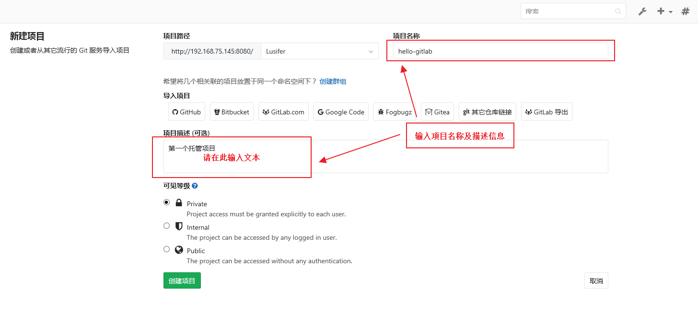

## 初始化项目

我们选择通过增加一个 README 的方式来初始化项目

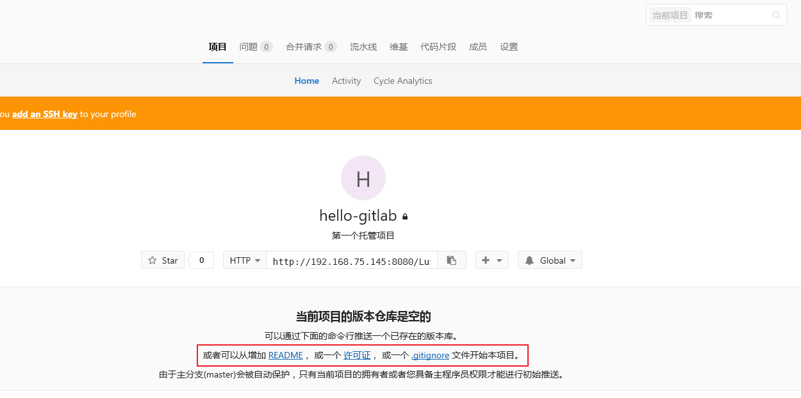

直接提交修改即可

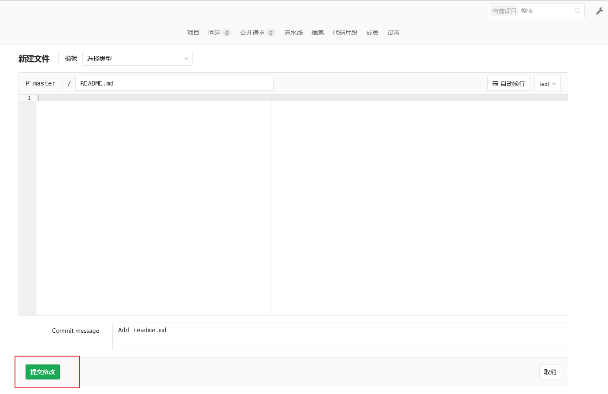

## 使用 SSH 的方式拉取和推送项目

### 生成 SSH KEY

使用 ssh-keygen 工具生成，位置在 Git 安装目录下，我的是 `C:\Program Files\Git\usr\bin`

输入命令：

```text
ssh-keygen -t rsa -C "your_email@example.com"
```

执行成功后的效果：

```text
Microsoft Windows [版本 10.0.14393]
(c) 2016 Microsoft Corporation。保留所有权利。

C:\Program Files\Git\usr\bin>ssh-keygen -t rsa -C "topsale@vip.qq.com"
Generating public/private rsa key pair.
Enter file in which to save the key (/c/Users/Lusifer/.ssh/id_rsa):
Enter passphrase (empty for no passphrase):
Enter same passphrase again:
Your identification has been saved in /c/Users/Lusifer/.ssh/id_rsa.
Your public key has been saved in /c/Users/Lusifer/.ssh/id_rsa.pub.
The key fingerprint is:
SHA256:cVesJKa5VnQNihQOTotXUAIyphsqjb7Z9lqOji2704E topsale@vip.qq.com
The key's randomart image is:
+---[RSA 2048]----+
|  + ..=o=.  .+.  |
| o o + B .+.o.o  |
|o   . + +=o+..   |
|.=   .  oo...    |
|= o     So       |
|oE .    o        |
| .. .. .         |
| o*o+            |
| *B*oo           |
+----[SHA256]-----+

C:\Program Files\Git\usr\bin>
```

### 复制 SSH-KEY 信息到 GitLab

秘钥位置在：`C:\Users\你的用户名\.ssh` 目录下，找到 `id_rsa.pub` 并使用编辑器打开，如：


登录 GitLab，点击“用户头像”-->“设置”-->“SSH 密钥”

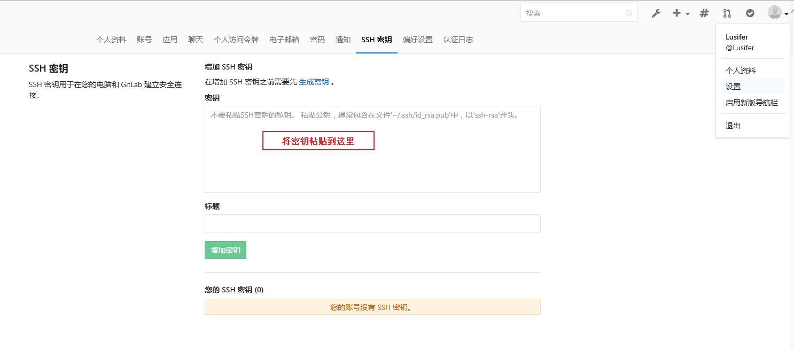

成功增加密钥后的效果


### 使用 TortoiseGit 克隆项目

- 新建一个存放代码仓库的本地文件夹
- 在文件夹空白处按右键
- 选择“Git 克隆...”

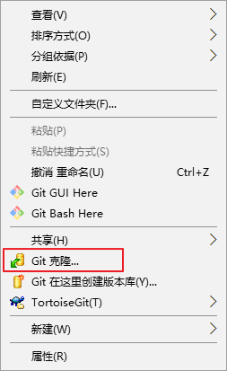

- 服务项目地址到 URL

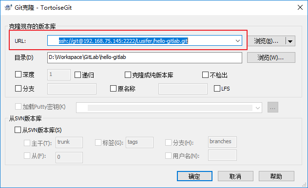

- 如果弹出连接信息请选择是


- 成功克隆项目到本地

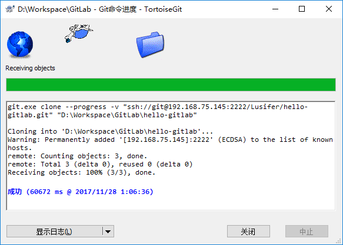

### 使用 TortoiseGit 推送项目（提交代码）

- 创建或修改文件（这里的文件为所有文件，包括：代码、图片等）
- 我们以创建 `.gitignore` 过滤配置文件为例，该文件的主要作用为过滤不需要上传的文件，比如：IDE 生成的工程文件、编译后的 class 文件等
- 在工程目录下，新建 `.gitignore` 文件，并填入如下配置：

```text
.gradle
*.sw?
.#*
*#
*~
/build
/code
.classpath
.project
.settings
.metadata
.factorypath
.recommenders
bin
build
target
.factorypath
.springBeans
interpolated*.xml
dependency-reduced-pom.xml
build.log
_site/
.*.md.html
manifest.yml
MANIFEST.MF
settings.xml
activemq-data
overridedb.*
*.iml
*.ipr
*.iws
.idea
.DS_Store
.factorypath
dump.rdb
transaction-logs
**/overlays/
**/logs/
**/temp/
**/classes/
```

- 右键呼出菜单，选择“提交 Master...”

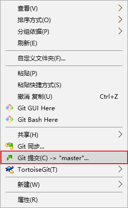

- 点击“全部”并填入“日志信息”

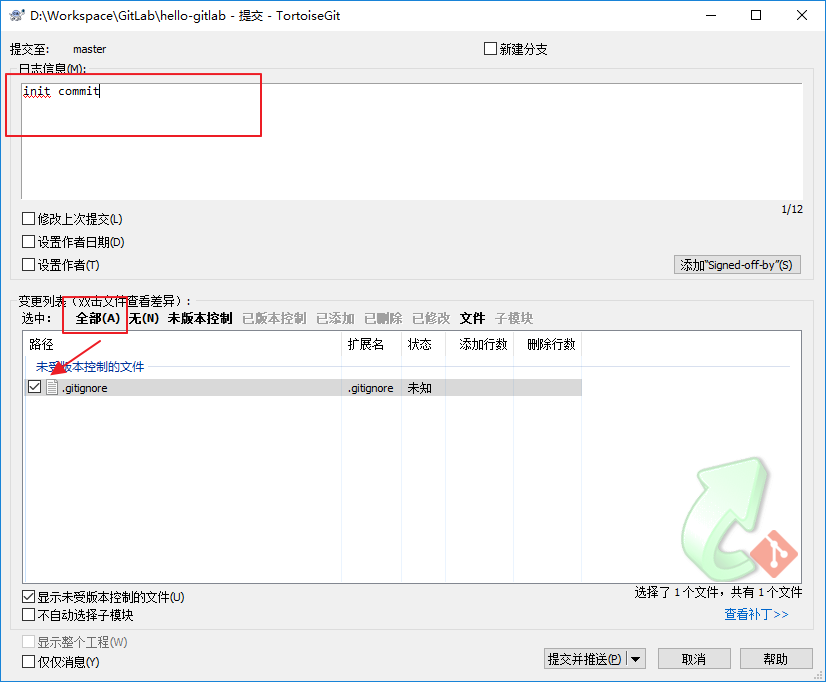

- 点击“提交并推送”


- 成功后的效果图

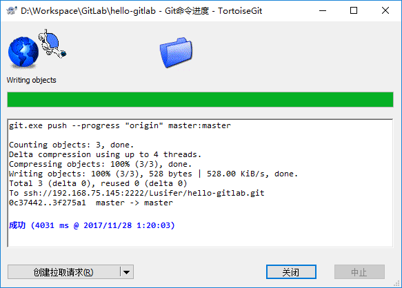

## 查看 GitLab 确认提交成功

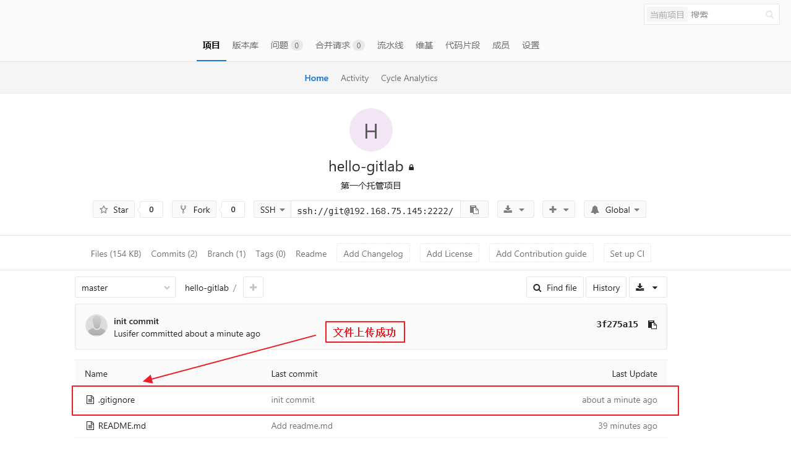