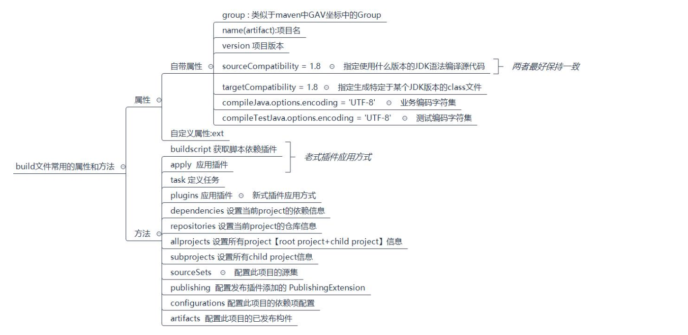

# Build.gradle 文件

* build.gradle 是一个 gradle 的构建脚本文件，支持 java、groovy 等语言。
* <font color="#0003ff">每个 project 都会有一个 build.gradle 文件</font>，该文件是项目构建的入口，可配置版本、插件、依赖库等信息。
* 每个 build 文件都有一个对应的 Project 实例，对 build.gradle 文件配置，本质就是设置 Project 实例的属性和方法。
* 由于每个 project 都会有一个 build 文件，那么 Root Project 也不列外。Root Project 可以获取到所有 Child Project，所以在 Root Project 的 build 文件中我们可以对 Child Project 统一配置,比如应用的插件、依赖的 maven 中心仓库等。



## 常见属性代码

代码参考：

~~~groovy
//指定使用什么版本的JDK语法编译源代码,跟编译环境有关,在有java插件时才能用
sourceCompatibility = 1.8
//指定生成特定于某个JDK版本的class文件:跟运行环境有关,在有java插件时才能用
targetCompatibility = 1.8
//业务编码字符集,注意这是指定源码解码的字符集[编译器]
compileJava.options.encoding "UTF-8"
//测试编码字符集,注意这是指定源码解码的字符集[编译器]
compileTestJava.options.encoding "UTF-8"
//编译JAVA文件时采用UTF-8:注意这是指定源码编码的字符集【源文件】
tasks.withType(JavaCompile) {
	options.encoding = "UTF-8"
} 
//编译JAVA文件时采用UTF-8:注意这是指定文档编码的字符集【源文件】
tasks.withType(Javadoc) {
	options.encoding = "UTF-8"
}
~~~

<font color="red">提示 1：group+name+version 类似于 maven 的 group+artifactId+version</font>

<font color="red">提示 2：encoding 解决业务代码与测试代码中文乱码问题</font>


## Repositories

~~~groovy
repositories {
    //gradle中会按着仓库配置的顺序，从上往下依次去对应的仓库中找所需要的jar包:
    //如果找到，则停止向下搜索，如果找不到，继续在下面的仓库中查找
    //指定去本地某个磁盘目录中查找:使用本地file文件协议:一般不用这种方式
    maven { url 'file:///D:/repos/mavenrepos3.5.4'}
    maven { url "$rootDir/lib/release" }
    //指定去maven的本地仓库查找
    mavenLocal()
    //指定去maven的私服或者第三方镜像仓库查找
    maven { name "Alibaba" ; url "https://maven.aliyun.com/repository/public" }
    maven { name "Bstek" ; url "https://nexus.bsdn.org/content/groups/public/" }
    //指定去maven的远程仓库查找:即 https://repo.maven.apache.org/maven2/
    mavenCentral()
    //去google仓库查找
    google()
}
~~~

因为 Gradle 没有自己的远程仓库，而是使用 Maven、jcenter、jvy、google 这些远程仓库。  

## Subprojects 与 Allprojects

allprojects 是对所有 project(包括 Root Project+ child Project[**当前工程和所有子工程**])的进行统一配置，而 subprojects 是对所有 Child Project 的**进行统一配置**。

~~~groovy
allprojects {
    tasks.create('hello') {
        doLast { task -> println "project name is $task.project.name"
        }
    }
}
subprojects {
    hello.doLast { task -> println "here is subprojects $task.project.name"
    }
}
~~~

通常在 subprojects 和 allprojects 中：

~~~groovy
allprojects(){ //本质Project中的allprojects方法， 传递一个闭包作为参数。
    apply plugin: 'java'
    ext {
    	junitVersion = '4.10'
    	..
    } 
    task allTask{
    	...
    } 
    repositories {
    	...
    } 
    dependencies {
    	...
    }
} 
subprojects(){
    …//同上面allprojects中的方法。
}
~~~

<font color="red">拓展 1</font>：如果是直接在**根 project 配置** repositories 和 dependencies 则**只针对根工程有效**。 

<font color="red">拓展 2</font>：我们也可以在对单个 Project 进行单独配置：

~~~groovy
project('subject01') {
    task subject01 {
        doLast {
        	println 'for subject01'
        }
    }
}
~~~

执行 gradle build 指令即可查看测试效果。

## ext 用户自定义属性

Project 和 Task 都允许用户添加额外的自定义属性，要添加额外的属性，通过应用所属对象的 ext 属性即可实现。添加之后可以通过 ext 属性对自定义属性读取和设置，如果要同时添加多个自定义属性，可以通过 ext 代码块:  

~~~groovy
//自定义一个Project的属性
ext.age = 18
//通过代码块同时自定义多个属性
ext {
    phone = 15539866006
    address = "大吉吧"
}
task extCustomProperty {
//在task中自定义属性
    ext {
        desc = "食雪"
    }
    doLast {
        println "年龄是：${age}"
        println "电话是：${phone}"
        println "地址是：${address}"
        println "dfd：${desc}"
    }
}
~~~

测试：通过 `gradle extCustomProperty`


<font color="red">拓展 1</font>：ext 配置的是用户自定义属性，而 gradle.properties 中一般定义 系统属性、环境变量、项目属性、JVM 相关配置信息。例如

gradle.properties 文件案例：加快构建速度的，gradle.properties 文件中的属性会自动在项目运行时加载。

~~~properties
## 设置此参数主要是编译下载包会占用大量的内存，可能会内存溢出
org.gradle.jvmargs=-Xms4096m -Xmx8192m
## 开启gradle缓存
org.gradle.caching=true
#开启并行编译
org.gradle.parallel=true
#启用新的孵化模式
org.gradle.configureondemand=true
#开启守护进程
org.gradle.daemon=true
~~~

详细请参考：[Build Environment (gradle.org)](https://docs.gradle.org/current/userguide/build_environment.html#sec:gradle_configuration_properties)

## Buildscript

buildscript 里是 gradle 脚本执行所需依赖，分别是对应的 maven 库和插件。

```groovy
buildscript {
    repositories {
        mavenCentral()
    }
    dependencies {
        classpath group: 'commons-codec', name: 'commons-codec', version: '1.2'
    }
}
tasks.register('encode') {
    doLast {
        def byte[] encodedString = new Base64().encode('hello world\n'.getBytes())
        println new String(encodedString)
    }
}
```

> 1. buildscript{}必须在 build.gradle 文件的最前端。
> 2. 对于多项目构建，项目的 buildscript ()方法声明的依赖关系可用于其所有子项目的构建脚本。
> 3. 构建脚本依赖可能是 Gradle 插件。  

~~~groovy
//老式apply插件的引用方式,使用apply+buildscript
buildscript {
    ext {
    	springBootVersion = "2.3.3.RELEASE"
    } 
    repositories {
        mavenLocal()
        maven { url 'http://maven.aliyun.com/nexus/content/groups/public' }
        jcenter()
    }
    //此处引入插件
    dependencies {
    	classpath("org.springframework.boot:spring-boot-gradle-plugin:${springBootVersion}")
    }
} 
apply plugin: 'java' //核心插件，无需事先引入
apply plugin: 'org.springframework.boot' //社区插件，需要事先引入,才能应用，不必写版本号
~~~

