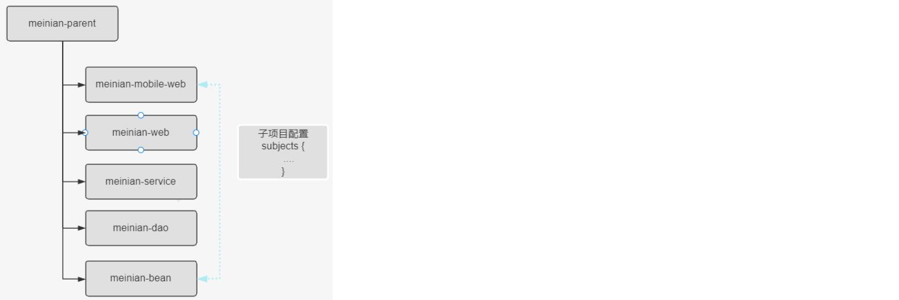

# 基于 SSM 多模块项目案例

## 多项目模块划分

meinian-mobile-web：	美年旅游项目的用户系统
meinian-web：			     美年旅游项目的管理员系统
meinian-service： 	       美年旅游项目的业务逻辑层
meinian-dao： 			     美年旅游项目的持久化层
meinian-bean： 			   美年旅游项目的 Model 封装  

## 项目搭建前配置分析

## 项目配置

### settings.gradle 文件

~~~groovy
rootProject.name = 'meinian-parent'
include 'meinian-web'
include 'meinian-mobile-web'
include 'meinian-service'
include 'meinian-dao'
include 'meinian-bean'
~~~

### 根 build.gradle 文件

~~~groovy
plugins {
    id 'java'
}
group 'com.meinian'
version '1.0-SNAPSHOT'

subprojects {
    //添加插件
    apply plugin: 'java'
    //基本JDK配置
    sourceCompatibility = 1.8
    targetCompatibility = 1.8
    compileJava.options.encoding "UTF-8"
    compileTestJava.options.encoding "UTF-8"

    tasks.withType(JavaCompile) {
        options.encoding = "UTF-8"
    }

    group 'com.meinian'
    version '1.0-SNAPSHOT'

    repositories {
        mavenLocal()
        maven { url "https://maven.aliyun.com/repository/public" }
        maven { url "https://maven.aliyun.com/repository/central" }
        maven { url "https://maven.aliyun.com/repository/google" }
        maven { url "https://maven.aliyun.com/repository/spring" }
        mavenCentral()
    }
    //依赖的配置:设置通用的依赖
    dependencies {
        testImplementation 'org.junit.jupiter:junit-jupiter-api'
        testRuntimeOnly 'org.junit.jupiter:junit-jupiter-engine'
        implementation 'log4j:log4j:1.2.17'
    }

    test {
        useJUnitPlatform()
    }
}

project("meinian-bean") {
    dependencies {
        compileOnly 'org.projectlombok:lombok:1.18.24'
    }
}
project("meinian-dao") {
    apply plugin: 'java-library'//支持api
    dependencies {
        api project(':meinian-bean')
        implementation 'org.mybatis:mybatis-spring:1.2.3'
        implementation 'com.alibaba:druid:1.0.15'
        implementation 'org.mybatis:mybatis:3.3.0'
        implementation 'mysql:mysql-connector-java:8.0.29'
    }
}
project("meinian-service") {
    apply plugin: 'java-library'//支持api
    dependencies {
        api project(':meinian-dao')
        implementation 'org.springframework:spring-web:4.1.7.RELEASE'
        implementation 'org.springframework:spring-test:4.0.5.RELEASE'
        implementation 'org.springframework:spring-jdbc:4.1.7.RELEASE'
        implementation 'org.aspectj:aspectjweaver:1.8.6'
    }
}
project("meinian-web") {
    apply plugin: 'war'
    dependencies {
        implementation project(':meinian-service')
        implementation 'org.springframework:spring-webmvc:4.1.7.RELEASE'
        implementation "com.fasterxml.jackson.core:jackson-databind:2.2.3"
        implementation "com.fasterxml.jackson.core:jackson-annotations:2.2.3"
        implementation "com.fasterxml.jackson.core:jackson-core:2.2.3"
        compileOnly 'javax.servlet:servlet-api:2.5'
        implementation 'jstl:jstl:1.2'
    }
}
project("meinian-mobile-web") {
    apply plugin: 'war'
    dependencies {
        //implementation project(':meinian-bean')
        implementation project(':meinian-service')
        implementation 'org.springframework:spring-webmvc:4.1.7.RELEASE'
        implementation "com.fasterxml.jackson.core:jackson-databind:2.2.3"
        implementation "com.fasterxml.jackson.core:jackson-annotations:2.2.3"
        implementation "com.fasterxml.jackson.core:jackson-core:2.2.3"
        compileOnly 'javax.servlet:servlet-api:2.5'
        implementation 'jstl:jstl:1.2'
    }
}
~~~

### 其他子目录的 build.gradle 文件

删除全部内容即可（空白）。

## 代码演示

### bean

在 meinian-bean 中创建 Admin

~~~java
package com.meinian.bean;

import java.io.Serializable;

public class Admin implements Serializable {
    private Integer id;
    private String username;
    private String email;

    public Integer getId() {
        return id;
    }

    public void setId(Integer id) {
        this.id = id;
    }

    public String getUsername() {
        return username;
    }

    public void setUsername(String username) {
        this.username = username;
    }

    public String getEmail() {
        return email;
    }

    public void setEmail(String email) {
        this.email = email;
    }

    @Override
    public String toString() {
        return "Admin{" + "id=" + id + ", username='" + username + '\'' + ", email='" + email + '\'' + '}';
    }
}

~~~

### dao

在 meinian-dao 中创建 AdminMapper

~~~java
package com.meinian.mapper;

import com.meinian.bean.Admin;

import java.util.List;

public interface AdminMapper {

    public List<Admin> getAdminList();
}
~~~

~~~xml
<?xml version="1.0" encoding="UTF-8" ?>
<!DOCTYPE mapper PUBLIC "-//mybatis.org//DTD Mapper 3.0//EN" "http://mybatis.org/dtd/mybatis-3-mapper.dtd">
<mapper namespace="com.meinian.mapper.AdminMapper">
    <select id="getAdminList" resultType="com.meinian.bean.Admin">
        select id, username, email
        from admin
    </select>
</mapper>
~~~

~~~properties
# jdbc.properties
jdbc.jdbcUrl=jdbc:mysql://192.168.25.10:3306/gradle?useUnicode=true&characterEncoding=utf-8&useSSL=false&serverTimezone=GMT%2B8
jdbc.driverClass=com.mysql.cj.jdbc.Driver
jdbc.userName=root
jdbc.password=111111
~~~

~~~xml
<!-- mybatis-config.xml -->
<?xml version="1.0" encoding="UTF-8" ?>
<!DOCTYPE configuration
        PUBLIC "-//mybatis.org//DTD Config 3.0//EN"
        "http://mybatis.org/dtd/mybatis-3-config.dtd">
<configuration>
</configuration>
~~~

### service

在 meinian-service 中创建 AdminService

~~~java
package com.meinian.service;

import com.meinian.bean.Admin;
import com.meinian.mapper.AdminMapper;
import org.springframework.beans.factory.annotation.Autowired;
import org.springframework.stereotype.Service;
import org.springframework.transaction.annotation.Transactional;

import java.util.List;

@Service
public class AdminService {

    @Autowired
    private AdminMapper adminMapper;

    @Transactional
    public List<Admin> getAdminList() {
        return adminMapper.getAdminList();
    }
}

~~~

~~~xml
<!-- applicationContext.xml -->
<?xml version="1.0" encoding="UTF-8"?>
<beans xmlns="http://www.springframework.org/schema/beans"
       xmlns:xsi="http://www.w3.org/2001/XMLSchema-instance"
       xmlns:context="http://www.springframework.org/schema/context" xmlns:tx="http://www.springframework.org/schema/tx"
       xsi:schemaLocation="http://www.springframework.org/schema/beans http://www.springframework.org/schema/beans/spring-beans.xsd http://www.springframework.org/schema/context https://www.springframework.org/schema/context/spring-context.xsd http://www.springframework.org/schema/tx http://www.springframework.org/schema/tx/spring-tx.xsd">

    <!-- 1.加载properties文件 -->
    <context:property-placeholder location="classpath:jdbc.properties"></context:property-placeholder>

    <!-- 2.配置数据源 -->
    <bean id="dataSource" class="com.alibaba.druid.pool.DruidDataSource">
        <property name="username" value="${jdbc.userName}"></property>
        <property name="password" value="${jdbc.password}"></property>
        <property name="url" value="${jdbc.jdbcUrl}"></property>
        <property name="driverClassName" value="${jdbc.driverClass}"></property>
    </bean>

    <!-- 0.配置扫描包 -->
    <context:component-scan base-package="com.meinian">
        <context:exclude-filter type="annotation" expression="org.springframework.stereotype.Controller"/>
        <context:exclude-filter type="annotation"
                                expression="org.springframework.web.bind.annotation.ControllerAdvice"/>
    </context:component-scan>

    <!-- 4.配置数据源事务管理器 -->
    <bean id="transactionManager" class="org.springframework.jdbc.datasource.DataSourceTransactionManager">
        <property name="dataSource" ref="dataSource"></property>
    </bean>
    <tx:annotation-driven transaction-manager="transactionManager"></tx:annotation-driven>

    <!-- 1.配置spring整合mybatis -->
    <bean class="org.mybatis.spring.SqlSessionFactoryBean">
        <property name="dataSource" ref="dataSource"></property>
        <property name="configLocation" value="classpath:mybatis-config.xml"></property>
    </bean>

    <!-- 2.配置扫描mapper接口的bean对象 -->
    <bean class="org.mybatis.spring.mapper.MapperScannerConfigurer">
        <property name="basePackage" value="com.meinian.mapper"/>
    </bean>

</beans>
~~~

### web

在 meinian-web 中创建 AdminController

~~~java
package com.meinian.controller;

import com.meinian.bean.Admin;
import com.meinian.service.AdminService;
import org.springframework.beans.factory.annotation.Qualifier;
import org.springframework.stereotype.Controller;
import org.springframework.web.bind.annotation.RequestMapping;
import org.springframework.web.bind.annotation.ResponseBody;

import javax.annotation.Resource;
import java.util.List;

@Controller
@RequestMapping("/admin")
public class AdminController {

    @Qualifier
    @Resource
    private AdminService adminService;

    @RequestMapping("/list")
    @ResponseBody
    public List<Admin> getAdminList() {
        System.out.println("进来了");
        List<Admin> adminList = adminService.getAdminList();
        System.out.println("出去了");
        return adminList;
    }

}
~~~

~~~xml
<!-- springmvc.xml -->
<?xml version="1.0" encoding="UTF-8"?>
<beans xmlns="http://www.springframework.org/schema/beans"
       xmlns:xsi="http://www.w3.org/2001/XMLSchema-instance"
       xmlns:context="http://www.springframework.org/schema/context"
       xmlns:mvc="http://www.springframework.org/schema/mvc"
       xsi:schemaLocation="http://www.springframework.org/schema/beans http://www.springframework.org/schema/beans/spring-beans.xsd http://www.springframework.org/schema/context https://www.springframework.org/schema/context/spring-context.xsd http://www.springframework.org/schema/mvc https://www.springframework.org/schema/mvc/spring-mvc.xsd">

    <!-- 1.配置扫描包 -->
    <context:component-scan base-package="com.meinian" use-default-filters="false">
        <context:include-filter type="annotation" expression="org.springframework.stereotype.Controller"/>
        <context:include-filter type="annotation"
                                expression="org.springframework.web.bind.annotation.ControllerAdvice"/>
    </context:component-scan>

    <!-- 2.配置内部资源视图解析器-->
    <bean class="org.springframework.web.servlet.view.InternalResourceViewResolver">
        <property name="prefix" value="/WEB-INF/"/>
        <property name="suffix" value=".jsp"/>
    </bean>
    <!--3.处理静态资源文件 -->
    <mvc:default-servlet-handler/>
    <mvc:annotation-driven/>
</beans>
~~~

~~~xml
<!--webapp/WEB-INF/web.xml-->
<?xml version="1.0" encoding="UTF-8"?>
<web-app version="2.4"
         xmlns="http://java.sun.com/xml/ns/j2ee"
         xmlns:xsi="http://www.w3.org/2001/XMLSchema-instance"
         xsi:schemaLocation="http://java.sun.com/xml/ns/j2ee
        http://java.sun.com/xml/ns/j2ee/web-app_2_4.xsd">

    <context-param>
        <!-- 指定spring 配置文件的路径和名称 -->
        <param-name>contextConfigLocation</param-name>
        <param-value>classpath:applicationContext.xml</param-value>
    </context-param>

    <!-- 指定spring的监听器 -->
    <listener>
        <listener-class>org.springframework.web.context.ContextLoaderListener</listener-class>
    </listener>

    <!-- 2.配置springmvc的前端控制器 -->
    <servlet>
        <servlet-name>DispatcherServlet</servlet-name>
        <servlet-class>org.springframework.web.servlet.DispatcherServlet</servlet-class>
        <init-param>
            <param-name>contextConfigLocation</param-name>
            <param-value>classpath:springmvc.xml</param-value>
        </init-param>
    </servlet>

    <servlet-mapping>
        <servlet-name>DispatcherServlet</servlet-name>
        <url-pattern>/</url-pattern>
    </servlet-mapping>

    <!-- 2.处理POST请求乱码的过滤器 -->
    <filter>
        <filter-name>CharacterEncodingFilter</filter-name>
        <filter-class>org.springframework.web.filter.CharacterEncodingFilter</filter-class>
        <init-param>
            <param-name>encoding</param-name>
            <param-value>UTF-8</param-value>
        </init-param>
    </filter>

    <filter-mapping>
        <filter-name>CharacterEncodingFilter</filter-name>
        <url-pattern>/*</url-pattern>
    </filter-mapping>

    <!-- 3.配置将POST请求转换为PUT或者DELETE请求的过滤器 -->
    <filter>
        <filter-name>HiddenHttpMethodFilter</filter-name>
        <filter-class>org.springframework.web.filter.HiddenHttpMethodFilter</filter-class>
    </filter>
    <filter-mapping>
        <filter-name>HiddenHttpMethodFilter</filter-name>
        <url-pattern>/*</url-pattern>
    </filter-mapping>
</web-app>
~~~