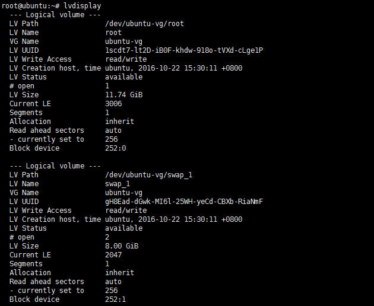
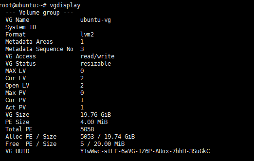
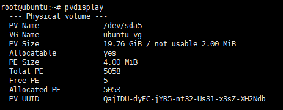
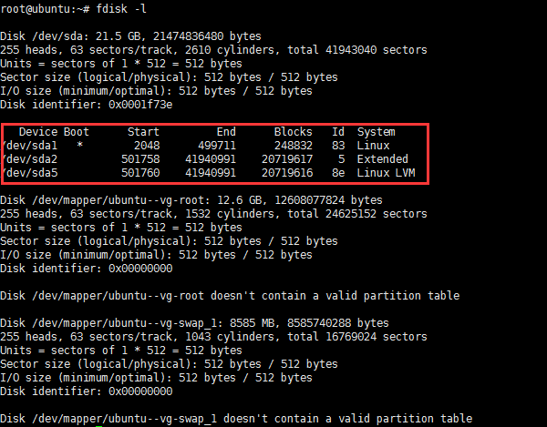
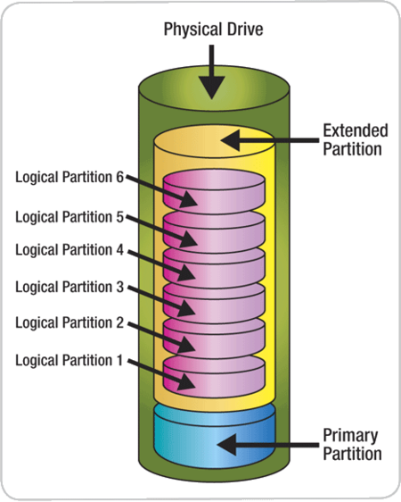
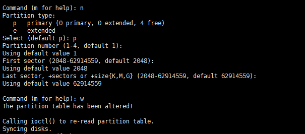
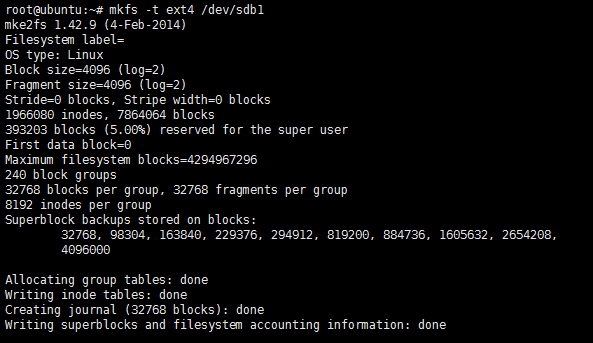
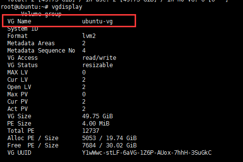
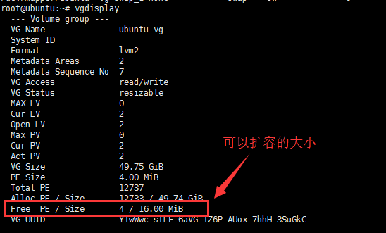
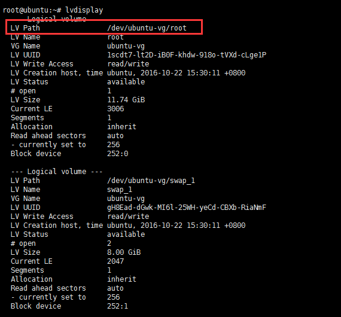

# 附：Linux LVM 磁盘扩容

## LVM 的基本概念

### 物理卷 Physical volume (PV)

可以在上面建立卷组的媒介，可以是硬盘分区，也可以是硬盘本身或者回环文件（loopback file）。物理卷包括一个特殊的 header，其余部分被切割为一块块物理区域（physical extents）。

### 卷组 Volume group (VG)

将一组物理卷收集为一个管理单元。

### 逻辑卷 Logical volume (LV)

虚拟分区，由物理区域（physical extents）组成。

### 物理区域 Physical extent (PE)

硬盘可供指派给逻辑卷的最小单位（通常为 4MB）。

## 磁盘操作相关命令

### `df -h`（查看挂载点）


### `lvdisplay`（显示当前的 logical volume）



**备注：** 注意这里目前有两个，一个是文件系统所在的 `volume`，另一个是 `swap` 分区使用的 `volume`，当然，我们需要扩容的是第一个

### `vgdisplay`（显示当前的 volume group）



**备注：** 注意 `VG SIZE`，这里应该是你当前的可用空间大小，待扩容完毕，这里显示的应该是最终的大小

### `pvdisplay`（显示当前的 physical volume）



## 开始 LVM 扩容

### 查看 fdisk

```text
fdisk -l
```



因为这台机器默认开启了 LVM，所以目前有一个 `extended` 分区和一个 `LVM` 分区，并且他们是完全重叠的。这是因为，LVM 分区作为一个虚拟的分区，完全占用了这个 extended 分区，原理图见下：



因此，现在需要做的就是将 extended partition (`sda2`) 扩展到最大，然后创建一个新的 LVM logical partition (`sda6`)，用它来填满 sda2

### 查看所有连接到电脑上的储存设备

```text
fdisk -l |grep '/dev'
```

#### 1 块磁盘效果图


#### 2 块磁盘效果图（新增磁盘，尚未挂载）


### 创建 `sdb` 分区

```text
fdisk /dev/sdb
n	# 新建分区
l	# 选择逻辑分区，如果没有，则首先创建扩展分区（p），然后再添加逻辑分区（硬盘：最多四个分区 P-P-P-P 或 P-P-P-E）
```



```text
回车
回车
回车
w	# 写入磁盘分区
```

### 格式化磁盘


```text
mkfs -t ext4 /dev/sdb1
```



### 创建 PV

```text
pvcreate /dev/sdb1
```

### 查看卷组

```text
pvscan
```


### 扩容 VG

```text
vgdisplay
```



```text
vgextend ubuntu-vg /dev/sdb1
```

### 扩容 LV





```text
# 增加指定大小
lvextend -L +30G /dev/ubuntu-vg/root
# 按百分比扩容
lvextend -l +100%FREE /dev/ubuntu-vg/root
```

### 刷新分区

```text
resize2fs /dev/ubuntu-vg/root
```

### 删除 unknown device

```text
pvscan
vgreduce --removemissing ubuntu-vg
```

**注意：不要卸载扩容的磁盘，可能出现丢失数据或是系统无法启动**