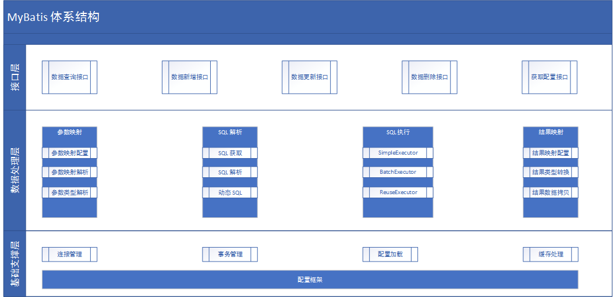
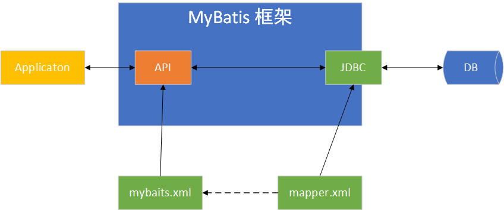

# MyBatis 简介

## 概述

MyBatis 是一个优秀的基于 Java 的持久层框架，它内部封装了 JDBC，使开发者只需关注 SQL 语句本身，而不用再花费精力去处理诸如注册驱动、创建 Connection、配置 Statement 等繁杂过程。

Mybatis 通过 xml 或注解的方式将要执行的各种 Statement（Statement、PreparedStatement 等）配置起来，并通过 Java 对象和 Statement 中 SQL 的动态参数进行映射生成最终执行的 SQL 语句，最后由 MyBatis 框架执行 SQL 并将结果映射成 Java 对象并返回。

## MyBatis 与 Hibernate

Hibernate 框架是提供了全面的数据库封装机制的 **“全自动”** ORM，即实现了 POJO 和数据库表之间的映射，以及 SQL 的自动生成和执行。

相对于此，MyBatis 只能算作是 **“半自动”** ORM。其着力点，是在 POJO 类与 SQL 语句之间的映射关系。也就是说，MyBatis 并不会为程序员自动生成 SQL 语句。具体的 SQL 需要程序员自己编写，然后通过 SQL 语句映射文件，将 SQL 所需的参数，以及返回的结果字段映射到指定 POJO。因此，MyBatis 成为了“全自动”ORM 的一种有益补充。

## MyBatis 的特点

- 在 XML 文件中配置 SQL 语句，实现了 SQL 语句与代码的分离，给程序的维护带来了很大便利。
- 因为需要程序员自己去编写 SQL 语句，程序员可以结合数据库自身的特点灵活控制 SQL 语句，因此能够实现比 Hibernate 等全自动 ORM 框架更高的查询效率，能够完成复杂查询。
- 简单，易于学习，易于使用，上手快。

