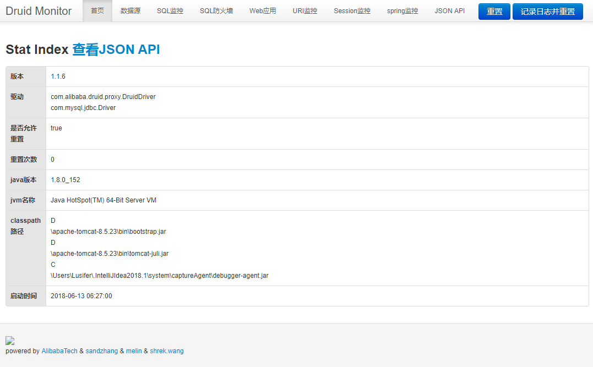

# Spring 整合 Druid

## POM

在 `pom.xml` 文件中新增 `com.alibaba:druid` 和 `mysql:mysql-connector-java` 依赖

```xml
<dependency>
    <groupId>com.alibaba</groupId>
    <artifactId>druid</artifactId>
    <version>1.1.6</version>
</dependency>
<dependency>
    <groupId>mysql</groupId>
    <artifactId>mysql-connector-java</artifactId>
    <version>5.1.46</version>
</dependency>
```

## 配置数据库连接

配置数据库连接 `jdbc.properties` ，配置代码如下：

```properties
# JDBC
# MySQL 8.x: com.mysql.cj.jdbc.Driver
jdbc.driverClass=com.mysql.jdbc.Driver
jdbc.connectionURL=jdbc:mysql://192.168.75.134:3306/myshop?useUnicode=true&characterEncoding=utf-8&useSSL=false
jdbc.username=root
jdbc.password=123456

# JDBC Pool
jdbc.pool.init=1
jdbc.pool.minIdle=3
jdbc.pool.maxActive=20

# JDBC Test
jdbc.testSql=SELECT 'x' FROM DUAL
```

## Spring 集成 Druid

创建一个名为 `spring-context-druid.xml` 的 Spring 配置文件，内容如下：

```xml
<?xml version="1.0" encoding="UTF-8"?>
<beans xmlns="http://www.springframework.org/schema/beans" xmlns:xsi="http://www.w3.org/2001/XMLSchema-instance"
       xmlns:context="http://www.springframework.org/schema/context"
       xsi:schemaLocation="http://www.springframework.org/schema/beans http://www.springframework.org/schema/beans/spring-beans.xsd http://www.springframework.org/schema/context http://www.springframework.org/schema/context/spring-context.xsd">

    <!-- 加载配置属性文件 -->
    <context:property-placeholder ignore-unresolvable="true" location="classpath:jdbc.properties"/>

    <!-- 数据源配置, 使用 Druid 数据库连接池 -->
    <bean id="dataSource" class="com.alibaba.druid.pool.DruidDataSource" init-method="init" destroy-method="close">
        <!-- 数据源驱动类可不写，Druid默认会自动根据URL识别DriverClass -->
        <property name="driverClassName" value="${jdbc.driverClass}"/>

        <!-- 基本属性 url、user、password -->
        <property name="url" value="${jdbc.connectionURL}"/>
        <property name="username" value="${jdbc.username}"/>
        <property name="password" value="${jdbc.password}"/>

        <!-- 配置初始化大小、最小、最大 -->
        <property name="initialSize" value="${jdbc.pool.init}"/>
        <property name="minIdle" value="${jdbc.pool.minIdle}"/>
        <property name="maxActive" value="${jdbc.pool.maxActive}"/>

        <!-- 配置获取连接等待超时的时间 -->
        <property name="maxWait" value="60000"/>

        <!-- 配置间隔多久才进行一次检测，检测需要关闭的空闲连接，单位是毫秒 -->
        <property name="timeBetweenEvictionRunsMillis" value="60000"/>

        <!-- 配置一个连接在池中最小生存的时间，单位是毫秒 -->
        <property name="minEvictableIdleTimeMillis" value="300000"/>

        <property name="validationQuery" value="${jdbc.testSql}"/>
        <property name="testWhileIdle" value="true"/>
        <property name="testOnBorrow" value="false"/>
        <property name="testOnReturn" value="false"/>

        <!-- 配置监控统计拦截的filters -->
        <property name="filters" value="stat"/>
    </bean>
</beans>
```

## 配置 Druid 监控中心

Druid 提供了大量的监控数据，只需要在 `web.xml` 中配置一个 Servlet 就可以方便的查看这些信息。

修改 `web.xml` 配置文件，增加 Druid 提供的 Servlet

```xml
<servlet>
    <servlet-name>DruidStatView</servlet-name>
    <servlet-class>com.alibaba.druid.support.http.StatViewServlet</servlet-class>
</servlet>
<servlet-mapping>
    <servlet-name>DruidStatView</servlet-name>
    <url-pattern>/druid/*</url-pattern>
</servlet-mapping>
```

打开浏览器，输入：http://localhost:8080/druid/index.html 浏览器显示效果如下：

