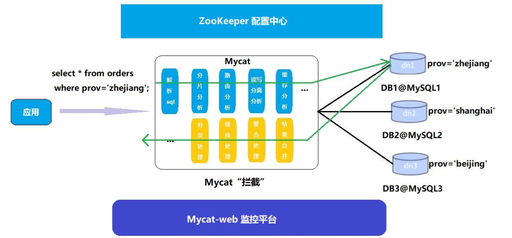

# Mycat 监控工具

## Mycat-web简介

Mycat-web 是 Mycat 可视化运维的管理和监控平台，弥补了 Mycat 在监控上的空白。帮 Mycat 分担统计任务和配置管理任务。 Mycat-web 引入了 ZooKeeper 作为配置中心，可以管理多个节点。Mycat-web 主要管理和监控 Mycat 的流量、连接、活动线程和内存等，具备 IP 白名单、邮件告警等模块，还可以统计 SQL 并分析慢 SQL 和高频 SQL 等。为优化 SQL 提供依据。  

## Mycat-web配置使用

1. **ZooKeeper 安装**  

   ~~~sh
   #1下载安装包http://zookeeper.apache.org/
   #2 安装包拷贝到Linux系统/opt目录下，并解压
   tar -zxvf zookeeper-3.4.11.tar.gz
   #3 进入ZooKeeper解压后的配置目录（conf） ，复制配置文件并改名
   cp zoo_sample.cfg zoo.cfg
   #4 进入ZooKeeper的命令目录（bin） ，运行启动命令
   ./zkServer.sh start
   #5 ZooKeeper服务端口为2181，查看服务已经启动
   netstat -ant | grep 2181
   ~~~

2. **Mycat-web 安装**

   ~~~sh
   #1.下载安装包
   #2 安装包拷贝到Linux系统/opt目录下，并解压
   tar -zxvf Mycat-web-1.0-SNAPSHOT-20170102153329-linux.tar.gz
   #3 拷贝mycat-web文件夹到/usr/local目录下
   cp -r mycat-web /usr/local
   #4 进入mycat-web的目录下运行启动命令
   cd /usr/local/mycat-web/
   ./start.sh &
   #5 Mycat-web服务端口为8082，查看服务已经启动
   netstat -ant | grep 8082
   #6 通过地址访问服务
   http://192.168.25.11:8082/mycat/
   ~~~

   

