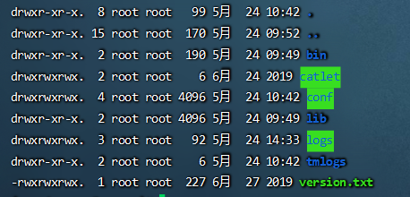
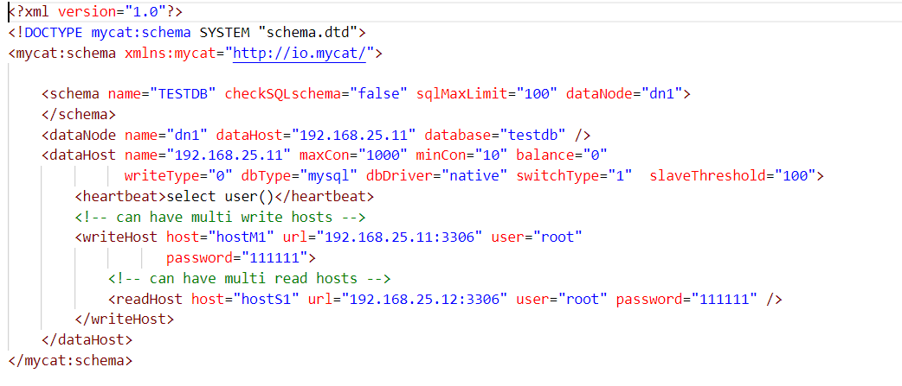

# 安装

首先需要准备两台MySQL，我本次使用的MySQL版本为8.0.17。

|     主机      | 端口 |  密码  |  名称  |
| :-----------: | :--: | :----: | :----: |
| 192.168.25.11 | 3306 | 111111 | Master |
| 192.168.25.12 | 3306 | 111111 | Slave  |

## 安装MySQL

本次采用Docker方式安装，需要首先安装Docker环境。

### docker-compose.yml

~~~yaml
version: '3.1'
services:
  mysql:
    image: mysql
    container_name: mysql
    restart: always
    environment:
      MYSQL_ROOT_PASSWORD: 111111
    command:
      --character-set-server=utf8mb4
      --collation-server=utf8mb4_general_ci
    ports:
      - 3306:3306
    volumes:
      - ./data:/var/lib/mysql
      - ./conf:/etc/mysql/
      - ./log:/var/log/mysql
      - ./mysql-files:/var/lib/mysql-files/
~~~

### my.cnf

~~~cnf
[client]
default-character-set=utf8mb4

[mysqld]
default-authentication-plugin=mysql_native_password
explicit_defaults_for_timestamp=true
lower_case_table_names=1
sql_mode=STRICT_TRANS_TABLES,ERROR_FOR_DIVISION_BY_ZERO,NO_ENGINE_SUBSTITUTION
~~~

### 启动

将my.cnf放在conf文件夹中，在docker-compose.yml同级目录执行命令：docker-compose up -d。

## 安装MyCat

1. 将Mycat-server-1.6.7.1解压后即可使用
   解压缩文件拷贝到 linux 下 /usr/local/
2. 三个配置文件
   ①schema.xml： 定义逻辑库，表、分片节点等内容
   ②rule.xml： 定义分片规则
   ③server.xml： 定义用户以及系统相关变量，如端口等 

### Docker方式安装

~~~sh
#新建目录
mkdir /root/data/mycat
#切换目录
cd /root/data/mycat
#下载mycat release1.6.7.6到当前目录
wget http://dl.mycat.org.cn/1.6.7.6/20201126013625/Mycat-server-1.6.7.6-release-20201126013625-linux.tar.gz
mv Mycat-server-1.6.7.6-release-20201126013625-linux.tar.gz mycat1.6.7.6.tar.gz
#解压conf目录到当前目录，因为使用docker直接挂载conf目录会报错，mycat启动时需要依赖conf目录中的文件。
tar -zxvf mycat1.6.7.6.tar.gz -C /root/data/ mycat/conf

#下载dockerfile文件到当前目录
wget https://raw.githubusercontent.com/AlphaYu/Adnc/master/doc/mycat/Dockerfile
#如果下载失败，请手动下载并上传到/root/data/mycat目录，文件地址如下
#https://github.com/AlphaYu/Adnc/blob/master/doc/mycat/Dockerfile
#创建镜像文件
docker build -t mycat:1.6.7.6 .
#运行容器并挂载配置文件目录与日志目录
#-v /root/data/mycat/conf:/usr/local/mycat/conf 挂载配置文件目录
#-v /root/data/mycat/logs:/usr/local/mycat/logs 挂载日志目录
# --network=adnc_net --ip 172.20.0.16  adnc_net是自建的bridge网络，如果使用docker默认网络，不需要这段
docker run --privileged=true -p 8066:8066 -p 9066:9066 --name mycat -v /root/data/mycat/conf:/usr/local/mycat/conf -v /root/data/mycat/logs:/usr/local/mycat/logs  mycat:1.6.7.6
~~~

## 修改配置

### server.xml

~~~xml
<user name="mycat" defaultAccount="true">
	<property name="password">111111</property>
	<property name="schemas">TESTDB</property>
</user>
~~~

### schema.xml

删除`<schema>`标签间的表信息， `<dataNode>`标签只留一个， `<dataHost>`标签只留一个， `<writeHost>`
`<readHost>`只留一对 。

~~~xml
<?xml version="1.0"?>
<!DOCTYPE mycat:schema SYSTEM "schema.dtd">
<mycat:schema xmlns:mycat="http://io.mycat/">
	<!--schema的名字指的是逻辑库，实际操作的库则是datanode中的指定的datebase-->
	<schema name="TESTDB" checkSQLschema="false" sqlMaxLimit="100" dataNode="dn1">
	</schema>
   	<!--dataHost可以随便写，只要下面dataHost中的name可以与之对应上即可，database是真实的物理库-->
	<dataNode name="dn1" dataHost="192.168.25.11" database="testdb" />
	<dataHost name="192.168.25.11" maxCon="1000" minCon="10" balance="0"
			  writeType="0" dbType="mysql" dbDriver="native" switchType="1"  slaveThreshold="100">
		<heartbeat>select user()</heartbeat>
		<!-- can have multi write hosts -->
		<writeHost host="hostM1" url="192.168.25.11:3306" user="root"
				   password="111111">
			<!-- can have multi read hosts -->
			<readHost host="hostS1" url="192.168.25.12:3306" user="root" password="111111" />
		</writeHost>
	</dataHost>
</mycat:schema>
~~~

## 测试

~~~sh
mysql -uroot -p111111 -h 192.168.25.11 -P 3306
mysql -uroot -p111111 -h 192.168.25.12 -P 3306
~~~

## 启动MyCat

* 控制台启动 ： 去 mycat/bin 目录下执行 ./mycat console，可以第一时间显示日志。
* 后台启动 ：去 mycat/bin 目录下 ./mycat start，不显示日志。 