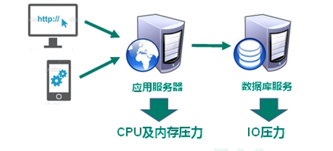
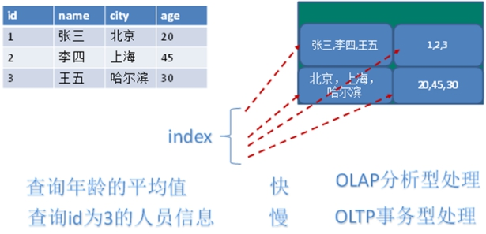

# NoSQL 数据库简介

## 技术发展

技术的分类

* 解决功能性的问题：Java、Jsp、RDBMS、Tomcat、HTML、Linux、JDBC、SVN
* 解决扩展性的问题：Struts、Spring、SpringMVC、Hibernate、Mybatis
* 解决性能的问题：NoSQL、Java线程、Hadoop、Nginx、MQ、ElasticSearch

### Web1.0 时代

Web1.0的时代，数据访问量很有限，用一夫当关的高性能的单点服务器可以解决大部分问题。

### Web2.0 时代

随着Web2.0的时代的到来，用户访问量大幅度提升，同时产生了大量的用户数据。加上后来的智能移动设备的普及，所有的互联网平台都面临了巨大的性能挑战。

### 解决CPU及内存压力

### 解决IO压力

## NoSQL 数据库

### NoSQL 数据库概述

NoSQL(NoSQL = **Not Only SQL** )，意即“不仅仅是SQL”，泛指**非关系型的数据库**。 

NoSQL 不依赖业务逻辑方式存储，而以简单的key-value模式存储。因此大大的增加了数据库的扩展能力。

* 不遵循SQL标准。
* 不支持ACID。
* 远超于SQL的性能。

### NoSQL 适用场景

* 对数据高并发的读写
* 海量数据的读写
* 对数据高可扩展性的

### NoSQL 不适用场景

* 需要事务支持
* 基于sql的结构化查询存储，处理复杂的关系,需要**即席**查询。
* （用不着sql 的和用了sql也不行的情况，请考虑用NoSql）

### Memcache

* 很早出现的NoSql数据库
* 数据都在内存中，一般**不持久化**
* 支持简单的key-value模式，**支持类型单一**
* 一般是作为**缓存数据库**辅助持久化的数据库

### Redis

* 几乎覆盖了Memcached的绝大部分功能
* 数据都在内存中，支持持久化，主要用作备份恢复
* 除了支持简单的key-value模式，还支持多种数据结构的存储，比如 list、set、hash、zset等。
* 一般是作为缓存数据库辅助持久化的数据库

### MongoDB

* 高性能、开源、模式自由(schema free)的**文档型数据库**
* 数据都在内存中， 如果内存不足，把不常用的数据保存到硬盘
* 虽然是key-value模式，但是对value（尤其是**json**）提供了丰富的查询功能
* 支持二进制数据及大型对象
* 可以根据数据的特点**替代RDBMS** ，成为独立的数据库。或者配合RDBMS，存储特定的数据。

## 行式存储数据库（大数据时代）

### 行式数据库

### 列式数据库

### Hbase

HBase是**Hadoop**项目中的数据库。它用于需要对大量的数据进行随机、实时的读写操作的场景中。

HBase的目标就是处理数据量**非常庞大**的表，可以用**普通的计算机**处理超过**10**亿行数据**，还可处理有数百万**列元素的数据表。

### Cassandra

Apache Cassandra是一款免费的开源NoSQL数据库，其设计目的在于管理由大量商用服务器构建起来的庞大集群上的**海量数据集**(数据量通常达到PB级别)。在众多显著特性当中，Cassandra最为卓越的长处是对写入及读取操作进行规模调整，而且其不强调主集群的设计思路能够以相对直观的方式简化各集群的创建与扩展流程。

## 图关系型数据库

主要应用：社会关系，公共交通网络，地图及网络拓谱(n*(n-1)/2)

## DB-Engines 数据库排名

[DB-Engines Ranking - popularity ranking of database management systems](https://db-engines.com/en/ranking)

