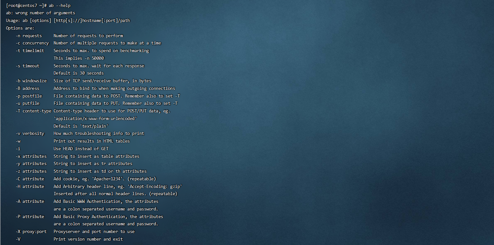

# Redis 事务—秒杀案例

## 解决计数器和人员记录的事务操作

## 代码编写

创建一个Web工程

~~~xml
<!--web.xml-->
<?xml version="1.0" encoding="UTF-8"?>
<web-app xmlns="http://java.sun.com/xml/ns/javaee"
	xmlns:xsi="http://www.w3.org/2001/XMLSchema-instance"
	xsi:schemaLocation="http://java.sun.com/xml/ns/javaee
		  http://java.sun.com/xml/ns/javaee/web-app_2_5.xsd"
	version="2.5">

	<servlet>
		<display-name>doseckill</display-name>
		<servlet-name>doseckill</servlet-name>
		<servlet-class>com.seckill.SecKillServlet</servlet-class>
	</servlet>
	<servlet-mapping>
		<servlet-name>doseckill</servlet-name>
		<url-pattern>/doseckill</url-pattern>
	</servlet-mapping>
	<filter>
		<filter-name>EncodingFilter</filter-name>
		<filter-class>com.seck.EncodingFilter</filter-class>
	</filter>
	<filter-mapping>
		<filter-name>EncodingFilter</filter-name>
		<url-pattern>/*</url-pattern>
	</filter-mapping>
</web-app>
~~~

~~~jsp
<!--index.jsp-->
<%@ page language="java" contentType="text/html; charset=UTF-8"
    pageEncoding="UTF-8"%>
<!DOCTYPE html PUBLIC "-//W3C//DTD HTML 4.01 Transitional//EN" "http://www.w3.org/TR/html4/loose.dtd">
<html>
<head>
<meta http-equiv="Content-Type" content="text/html; charset=UTF-8">
<title>Insert title here</title>
</head>
<body>
<h1>iPhone 13 Pro !!!  1元秒杀！！！
</h1>

<form id="msform" action="${pageContext.request.contextPath}/doseckill" enctype="application/x-www-form-urlencoded">
	<input type="hidden" id="prodid" name="prodid" value="0101">
	<input type="button"  id="miaosha_btn" name="seckill_btn" value="秒杀点我"/>
</form>

</body>

</html>
~~~

~~~java
/**
 * 秒杀案例
 */
public class SecKillServlet extends HttpServlet {
    private static final long serialVersionUID = 1L;

    public SecKillServlet() {
        super();
    }

    protected void doPost(HttpServletRequest request, HttpServletResponse response) throws IOException {

        String userid = new Random().nextInt(50000) + "";
        String prodid = request.getParameter("prodid");
		//秒杀业务处理
        boolean isSuccess=Seckill.doSecKill(userid,prodid);
        response.setContentType("text/html; charset=UTF-8");
        response.getWriter().print(isSuccess);
    }
}
~~~

~~~java
/**
 * 秒杀业务处理
 */
public class Seckill {

	//秒杀过程
	public static boolean doSecKill(String uid,String prodid) throws IOException {
		//1 uid和prodid非空判断
		if(uid == null || prodid == null) {
			return false;
		}

		//2 连接redis
		Jedis jedis = new Jedis("192.168.25.100",6379);

		//3 拼接key
		// 3.1 库存key
		String kcKey = "sk:"+prodid+":qt";
		// 3.2 秒杀成功用户key
		String userKey = "sk:"+prodid+":user";

		//监视库存
		jedis.watch(kcKey);

		//4 获取库存，如果库存null，秒杀还没有开始
		String kc = jedis.get(kcKey);
		if(kc == null) {
			System.out.println("秒杀还没有开始，请等待");
			jedis.close();
			return false;
		}

		// 5 判断用户是否重复秒杀操作
		if(jedis.sismember(userKey, uid)) {
			System.out.println("已经秒杀成功了，不能重复秒杀");
			jedis.close();
			return false;
		}

		//6 判断如果商品数量，库存数量小于1，秒杀结束
		if(Integer.parseInt(kc)<=0) {
			System.out.println("秒杀已经结束了");
			jedis.close();
			return false;
		}

		//7 秒杀过程
		//7.1 库存-1
		jedis.decr(kcKey);
		//7.2 把秒杀成功用户添加清单里面
		jedis.sadd(userKey,uid);

		System.out.println("秒杀成功了..");
		jedis.close();
		return true;
	}
}
~~~

## 秒杀并发模拟

### 使用工具ab模拟测试

#### 安装

~~~sh
yum install httpd-tools
~~~

#### 通过ab测试

**vim postfile 模拟表单提交参数,以&符号结尾;存放当前目录。**

~~~shell
prodid=0101&
~~~

使用命令

~~~sh
ab -n 2000 -c 200 -k -p ~/postfile -T application/x-www-form-urlencoded http://ip:port/Seckill/doseckill
~~~

### 使用Jmeter模拟测试

## 问题

### 超时

使用连接池可以有效解决这个问题，节省每次连接redis服务带来的消耗，把连接好的实例反复利用。通过参数管理连接的行为。

~~~java
public class JedisPoolUtil {
	private static volatile JedisPool jedisPool = null;

	private JedisPoolUtil() {
	}

	public static JedisPool getJedisPoolInstance() {
		if (null == jedisPool) {
			synchronized (JedisPoolUtil.class) {
				if (null == jedisPool) {
					JedisPoolConfig poolConfig = new JedisPoolConfig();
					poolConfig.setMaxTotal(200);
					poolConfig.setMaxIdle(32);
					poolConfig.setMaxWaitMillis(100*1000);
					poolConfig.setBlockWhenExhausted(true);
					poolConfig.setTestOnBorrow(true);  // ping  PONG
				 
					jedisPool = new JedisPool(poolConfig, "192.168.25.100", 6379, 60000);
				}
			}
		}
		return jedisPool;
	}

	public static void release(JedisPool jedisPool, Jedis jedis) {
		if (null != jedis) {
			jedisPool.returnResource(jedis);
		}
	}

}
~~~

~~~java
/**
 * 秒杀业务处理
 */
public class Seckill {
	.............
		//2 连接redis
		//通过连接池得到jedis对象
		JedisPool jedisPoolInstance = JedisPoolUtil.getJedisPoolInstance();
		Jedis jedis = jedisPoolInstance.getResource();
    .............
	}
}
~~~

* 链接池参数
  * MaxTotal：控制一个pool可分配多少个jedis实例，通过pool.getResource()来获取；如果赋值为-1，则表示不限制；如果pool已经分配了MaxTotal个jedis实例，则此时pool的状态为exhausted;
  * MaxIdle：控制一个pool最多有多少个状态为idle(空闲)的jedis实例；
  * MaxWaitMillis：表示当borrow一个jedis实例时，最大的等待毫秒数，如果超过等待时间，则直接抛JedisConnectionException；
  * TestOnBorrow：获得一个jedis实例的时候是否检查连接可用性（ping()）；如果为true，则得到的jedis实例均是可用的；

### 超卖

通过以上的测试可以看到在抢空后依然出现了抢购成功的提示。并且发现库存数量为负数。

利用乐观锁解决超卖问题。

~~~java
package com.atguigu;

import redis.clients.jedis.Jedis;
import redis.clients.jedis.JedisPool;
import redis.clients.jedis.Transaction;

import java.io.IOException;
import java.util.List;

/**
 * @author DD
 * @create 2022年11月14日 下午2:14:44
 */
public class SecKill {

    // 秒杀过程
    public static boolean doSecKill(String uid, String prodid) throws IOException {
        // 1 uid和prodid非空判断
        if (uid == null || prodid == null) {
            return false;
        }

        // 2 连接redis,通过连接池方式
        JedisPool poolInstance = JedisPoolUtil.getJedisPoolInstance();
        Jedis jedis = poolInstance.getResource();

        // 3 拼接key
        // 3.1 库存key
        String kcKey = "sk:" + prodid + ":qt";
        // 3.2 秒杀成功用户key
        String userKey = "sk:" + prodid + ":user";
        // 监视库存
        jedis.watch(kcKey);

        // 4 获取库存，如果库存null，秒杀还没有开始
        String kc = jedis.get(kcKey);
        if (kc == null || "".equals(kc)) {
            System.out.println("秒杀还没有开始，请等待");
			JedisPoolUtil.release(poolInstance, jedis);
            return false;
        }

        // 5 判断用户是否重复秒杀操作
        if (jedis.sismember(userKey, uid)) {
            System.out.println("已经秒杀成功了，不能重复秒杀");
			JedisPoolUtil.release(poolInstance, jedis);
            return false;
        }

        // 6 判断如果商品数量，库存数量小于1，秒杀结束
        if (Integer.parseInt(kc) <= 0) {
            System.out.println("秒杀已经结束了");
			JedisPoolUtil.release(poolInstance, jedis);
            return false;
        }

        // 7 秒杀过程
        // 开启事务
        Transaction transaction = jedis.multi();

        // 8 组合操作
        //库存-1
        transaction.decr(kcKey);
        //把秒杀成功用户添加清单里面
        transaction.sadd(userKey, uid);

        List<Object> exec = transaction.exec();

        if (exec == null || exec.size() == 0) {
            System.out.println("秒杀失败了....");
            JedisPoolUtil.release(poolInstance, jedis);
            return false;
        }

        System.out.println("秒杀成功了..");
		JedisPoolUtil.release(poolInstance, jedis);
        return true;
    }
}
~~~

### 库存遗留

~~~sh
ab -n 2000 -c 100 -p postfile -T 'application/x-www-form-urlencoded' http://IP:PORT/seckill/doseckill
~~~

已经秒光，可是还有库存。原因，就是乐观锁导致很多请求都失败。先点的没秒到，后点的可能秒到了。

**解决方案：LUA脚本**

* 将复杂的或者多步的redis操作，写为一个脚本，一次提交给redis执行，减少反复连接redis的次数。提升性能。
* LUA脚本是类似redis事务，有一定的原子性，不会被其他命令插队，可以完成一些redis事务性的操作。
* 但是注意redis的lua脚本功能，只有在Redis 2.6以上的版本才可以使用。
* 利用lua脚本淘汰用户，解决超卖问题。
* redis 2.6版本以后，通过lua脚本解决**争抢问题**，实际上是**redis** **利用其单线程的特性，用任务队列的方式解决多任务并发问题**。

