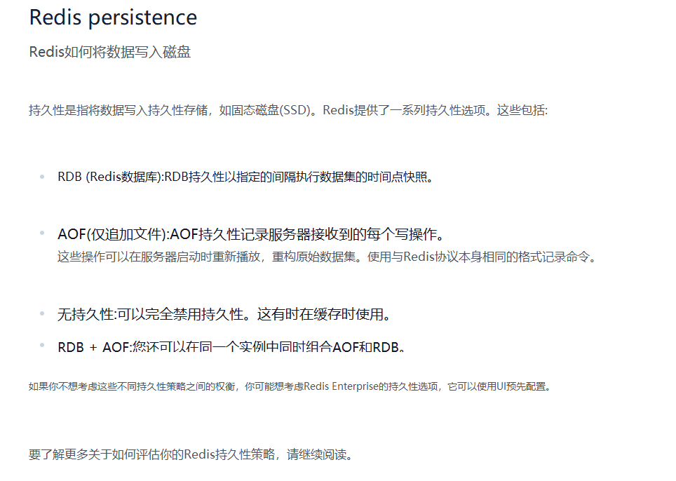
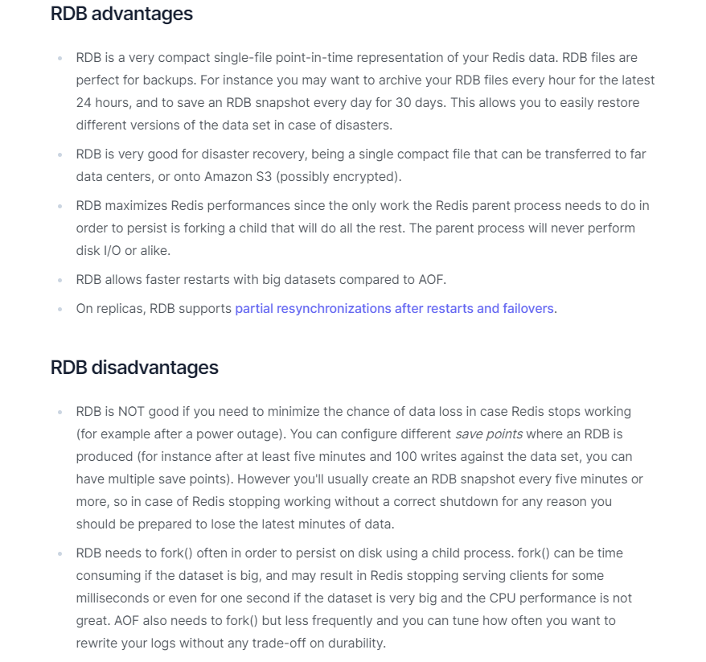
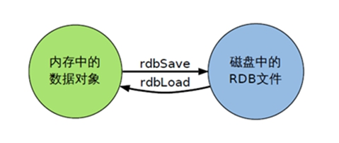
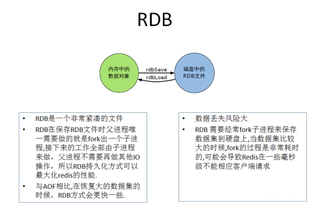

# Redis 持久化—RDB

## 总体介绍

官网介绍：[Redis](https://redis.io/)。

## RDB（Redis DataBase）

### 介绍

翻译

### 是什么

在指定的时间间隔内将内存中的数据集快照写入磁盘， 也就是行话讲的Snapshot**快照**，它恢复时是将快照文件直接读到内存里。

### 备份是如何执行的

Redis会单独创建（fork）一个**子进程**来进行持久化，会先将数据写入到 一个临时文件中，待持久化过程都结束了，再用这个**临时文件替换上次持久化好的文件**。 整个过程中，主进程是不进行任何IO操作的，这就确保了极高的性能 如果需要进行大规模数据的恢复，且对于数据恢复的完整性不是非常敏感，那RDB方式要比AOF方式更加的高效。RDB的缺点是**最后一次持久化后的数据可能丢失**。

### Fork

* Fork的作用是复制一个与当前进程一样的进程。新进程的所有数据（变量、环境变量、程序计数器等） 数值都和原进程一致，但是是一个全新的进程，并作为原进程的子进程。
* 在Linux程序中，fork()会产生一个和父进程完全相同的子进程，但子进程在此后多会exec系统调用，出于效率考虑，Linux中引入了“**写时复制技术**”。
* **一般情况父进程和子进程会共用同一段物理内存**，只有进程空间的各段的内容要发生变化时，才会将父进程的内容复制一份给子进程。

### RDB 持久化流程

### dump.rdb 文件

### 配置位置

rdb文件的保存路径，也可以修改。默认为Redis启动时命令行所在的目录下

### 如何触发 RDB 快照；保持策略

#### 配置文件中默认的快照配置

#### flushall 命令

执行flushall命令，也会产生dump.rdb文件，但里面是空的，无意义。

#### save 命令

格式：`save 秒钟 写操作次数`

RDB是整个内存的压缩过的Snapshot，RDB的数据结构，可以配置复合的快照触发条件。

**默认是1分钟内改了1万次，或5分钟内改了10次，或15分钟内改了1次。**

#### bgsave 命令

格式：`bgsave`
作用：手动启动后台保存操作，但不是立即执行。
注意：bgsave命令是针对save阻塞问题做的优化。Redis内部所有涉及到RDB操作都采用bgsave的方式，save命令可以放弃使用。

#### 命令 save VS bgsave

* save ：save时只管保存，其它不管，全部阻塞。手动保存。不建议。
* **bgsave：Redis会在后台异步进行快照操作， 快照同时还可以响应客户端请求。**

可以通过lastsave 命令获取最后一次成功执行快照的时间。

#### stop-writes-on-bgsave-error

当Redis无法写入磁盘的话，直接关掉Redis的写操作。**推荐yes**。

#### rdbcompression 压缩文件

对于存储到磁盘中的快照，可以设置是否进行压缩存储。如果是的话，redis会采用**LZF算法**进行压缩。如果你不想消耗CPU来进行压缩的话，可以设置为关闭此功能。推荐**yes**。

#### rdbchecksum 检查完整性

在存储快照后，还可以让redis使用CRC64算法来进行数据校验，但是这样做会增加大约10%的性能消耗，如果希望获取到最大的性能提升，可以关闭此功能。

推荐**yes**。

#### rdb的备份

* 先通过`config get dir`查询rdb文件的目录 
  * 将*.rdb的文件拷贝到别的地方

* rdb的恢复
  * 关闭Redis
  * 先把备份的文件拷贝到工作目录下 cp dump2.rdb dump.rdb
  * 启动Redis, 备份数据会直接加载

### 优势

* 适合大规模的数据恢复
* 对数据完整性和一致性要求不高更适合使用
* **节省磁盘空间**
* **恢复速度快**

### 劣势

* Fork的时候，内存中的数据被克隆了一份，大致2倍的膨胀性需要考虑。
* 虽然Redis在fork时使用了**写时拷贝技术**,但是如果数据庞大时还是比较消耗性能。

* 在备份周期在一定间隔时间做一次备份，所以如果Redis意外down掉的话，就会**丢失最后一次快照后的所有修改**。

### 如何停止

动态停止RDB：`redis-cli config set save ""`#save后给空值，表示禁用保存策略。

## 总结

