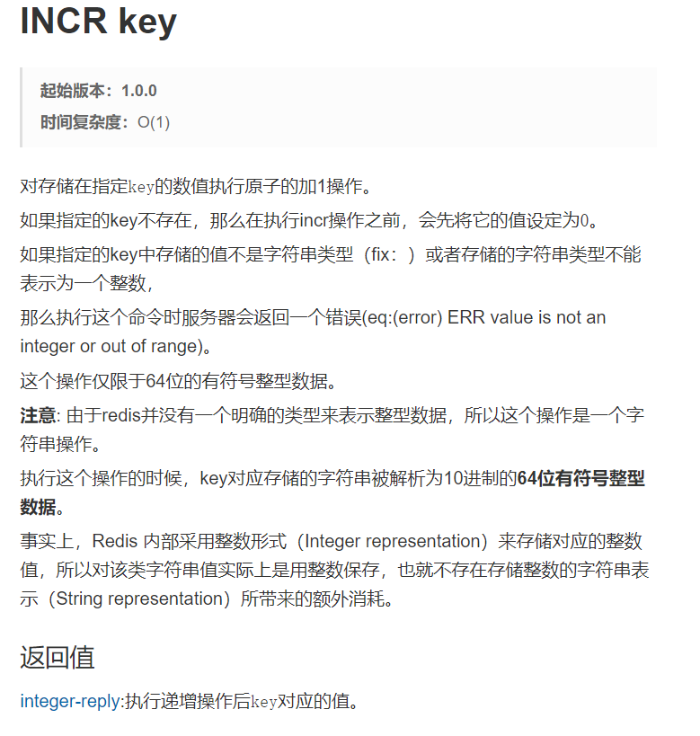

# 常用五大数据类型

哪里去获得redis常见数据类型操作命令[Redis命令中心（Redis commands）](http://www.redis.cn/commands.html)。

## Redis 键(key)

| 命令          | 说明                                                         |
| ------------- | ------------------------------------------------------------ |
| keys *        | 查看当前库所有key  (匹配：keys *1)                           |
| exists key    | 判断某个key是否存在                                          |
| type key      | 查看你的key是什么类型                                        |
| del key       | 删除指定的key数据                                            |
| unlink key    | 根据value选择非阻塞删除（仅将keys从keyspace元数据中删除，真正的删除会在后续异步操作。） |
| expire key 10 | 10秒钟：为给定的key设置过期时间                              |
| ttl key       | 查看还有多少秒过期，-1表示永不过期，-2表示已过期             |
| select        | 命令切换数据库                                               |
| dbsize        | 查看当前数据库的key的数量                                    |
| flushdb       | 清空当前库                                                   |
| flushall      | 通杀全部库                                                   |

## Redis 字符串(String)

### 简介

* String是Redis最基本的类型，你可以理解成与Memcached一模一样的类型，一个key对应一个value。
* String类型是二进制安全的。意味着Redis的string可以包含任何数据。比如jpg图片或者序列化的对象。
* String类型是Redis最基本的数据类型，一个Redis中字符串value最多可以是512M。

### 常用命令

set  `<key>` `<value>` 添加键值对

* NX：当数据库中key不存在时，可以将key-value添加数据库

* XX：当数据库中key存在时，可以将key-value添加数据库，与NX参数互斥

* EX：key的超时秒数

* PX：key的超时毫秒数，与EX互斥

get  `<key>` 查询对应键值

append `<key>` `<value>`将给定的`<value> `追加到原值的末尾

strlen `<key>`获得值的长度

setnx `<key>` `<value>`只有在 key 不存在时  设置 key 的值

incr `<key>`：将 key 中储存的数字值增1，只能对数字值操作，如果为空，新增值为1。

decr `<key>`：将 key 中储存的数字值减1，只能对数字值操作，如果为空，新增值为-1。

incrby / decrby `<key>` <步长> 将 key 中储存的数字值增减。自定义步长。

mset `<key1>` `<value1>` `<key2>` `<value2>` ...：同时设置一个或多个 key-value对 。

mget `<key1>`  `<key2>` ...：同时获取一个或多个 value 。

getrange `<key>` <起始位置> <结束位置>：获得值的范围，类似java中的substring，前包，后包

> 如果使用集群Redis的话，批量操作是会出现CROSSSLOT Keys in request don‘t hash to the same slot报错。
>
> **解决方案**
>
> hash tag 可以影响 hash slot 的生成，相同 hash tag 的 key 会被分配到相同的 hash slot。hash tag使用 {...} 形式。对于包含 hash tag 的 key，redis只会对 {} 内的字符串计算 hash，从而相同 hash tag 的 key 会计算得到相同的 hash slot。
>
> 例如：
>
> MSET {aaa}.key1 "hello" {aaa}.key2 "world"

### 原子性

比如

所谓**原子**操作是指不会被线程调度机制打断的操作，这种操作一旦开始，就一直运行到结束，中间不会有任何 context switch（切换到另一个线程）。

（1）在单线程中， 能够在单条指令中完成的操作都可以认为是"原子操作"，因为中断只能发生于指令之间。

（2）在多线程中，不能被其它进程（线程）打断的操作就叫原子操作。Redis单命令的原子性主要得益于Redis的单线程。

