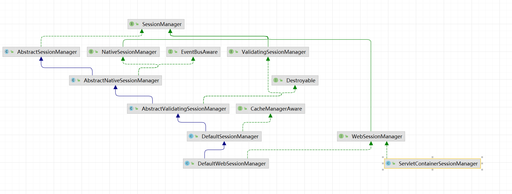

# 会话管理

## SessionManager  

会话管理器，负责创建和管理用户的会话（Session）生命周期，它能够在任何环境中在本地管理用户会话，即使没有Web / Servlet / EJB容器，也一样可以保存会话。默认情况下，Shiro会检测当前环境中现有的会话机制（比如Servlet容器）进行适配，如果没有 （比如独立应用程序或者非Web环境），它将会使用内置的企业会话管理器来提供相应的会话管理服务，其中还涉及一个名为SessionDAO的对象。SessionDAO负责Session的持久化操 作（CRUD），允许Session数据写入到后端持久化数据库。

## 会话管理实现

SessionManager由SecurityManager管理。Shiro提供了三种实现

* DefaultSessionManager：用于JavaSE环境

* ServletContainerSessionManager：用于web环境，直接使用Servlet容器的会话
* DefaultWebSessionManager：用于web环境，自己维护会话（不使用Servlet容器的 会话管理）

## 获得 Session 方式

~~~java
Session session = SecurityUtils.getSubject().getSession();
session.setAttribute(“key”,”value”);
~~~

Controller 中的 request，在 Shiro 过滤器中的 doFilerInternal 方法，被包装成 ShiroHttpServletRequest。SecurityManager 和 SessionManager 会话管理器决定 session 来源于 ServletRequest 还是由 Shiro 管理的会话。无论是通过 request.getSession 或 subject.getSession 获取到 session，操作 session，两者都是等价的。

