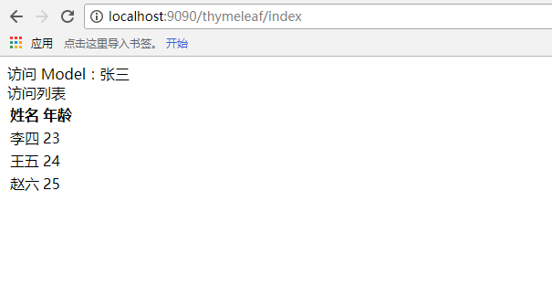

# 第一个 Thymeleaf 模板页

## 引入依赖

主要增加 `spring-boot-starter-thymeleaf` 和 `nekohtml` 这两个依赖

- `spring-boot-starter-thymeleaf`：Thymeleaf 自动配置
- `nekohtml`：允许使用非严格的 HTML 语法

完整的 `pom.xml` 如下：

```xml
<?xml version="1.0" encoding="UTF-8"?>
<project xmlns="http://maven.apache.org/POM/4.0.0" xmlns:xsi="http://www.w3.org/2001/XMLSchema-instance"
         xsi:schemaLocation="http://maven.apache.org/POM/4.0.0 http://maven.apache.org/xsd/maven-4.0.0.xsd">
    <modelVersion>4.0.0</modelVersion>

    <groupId>com.funtl</groupId>
    <artifactId>hello-spring-boot</artifactId>
    <version>0.0.1-SNAPSHOT</version>
    <packaging>jar</packaging>

    <name>hello-spring-boot</name>
    <description></description>

    <parent>
        <groupId>org.springframework.boot</groupId>
        <artifactId>spring-boot-starter-parent</artifactId>
        <version>2.0.2.RELEASE</version>
        <relativePath/> <!-- lookup parent from repository -->
    </parent>

    <properties>
        <project.build.sourceEncoding>UTF-8</project.build.sourceEncoding>
        <project.reporting.outputEncoding>UTF-8</project.reporting.outputEncoding>
        <java.version>1.8</java.version>
    </properties>

    <dependencies>
        <dependency>
            <groupId>org.springframework.boot</groupId>
            <artifactId>spring-boot-starter-web</artifactId>
        </dependency>
        <dependency>
            <groupId>org.springframework.boot</groupId>
            <artifactId>spring-boot-starter-tomcat</artifactId>
        </dependency>
        <dependency>
            <groupId>org.springframework.boot</groupId>
            <artifactId>spring-boot-starter-thymeleaf</artifactId>
        </dependency>
        <dependency>
            <groupId>org.springframework.boot</groupId>
            <artifactId>spring-boot-starter-actuator</artifactId>
        </dependency>
        <dependency>
            <groupId>org.springframework.boot</groupId>
            <artifactId>spring-boot-starter-test</artifactId>
            <scope>test</scope>
        </dependency>

        <dependency>
            <groupId>net.sourceforge.nekohtml</groupId>
            <artifactId>nekohtml</artifactId>
            <version>1.9.22</version>
        </dependency>
    </dependencies>

    <build>
        <plugins>
            <plugin>
                <groupId>org.springframework.boot</groupId>
                <artifactId>spring-boot-maven-plugin</artifactId>
                <configuration>
                    <mainClass>com.funtl.hello.spring.boot.HelloSpringBootApplication</mainClass>
                </configuration>
            </plugin>
        </plugins>
    </build>
</project>
```

## 在 `application.yml` 中配置 Thymeleaf

```yaml
spring:
  thymeleaf:
    cache: false # 开发时关闭缓存,不然没法看到实时页面
    mode: HTML # 用非严格的 HTML
    encoding: UTF-8
    servlet:
      content-type: text/html
```

## 创建测试用 JavaBean

创建一个测试效果的 JavaBean，简单封装一下即可

```java
package com.funtl.hello.spring.boot.entity;

import java.io.Serializable;

public class PersonBean implements Serializable {

    private String name;
    private Integer age;

    public String getName() {
        return name;
    }

    public void setName(String name) {
        this.name = name;
    }

    public Integer getAge() {
        return age;
    }

    public void setAge(Integer age) {
        this.age = age;
    }
}
```

## 创建测试用 Controller

创建一个 Controller，造一些测试数据并设置跳转

```java
package com.funtl.hello.spring.boot.controller;

import com.funtl.hello.spring.boot.entity.PersonBean;
import org.springframework.stereotype.Controller;
import org.springframework.ui.Model;
import org.springframework.web.bind.annotation.RequestMapping;
import org.springframework.web.bind.annotation.RequestMethod;

import java.util.ArrayList;
import java.util.List;

@Controller
@RequestMapping(value = "thymeleaf")
public class IndexController {

    @RequestMapping(value = "index", method = RequestMethod.GET)
    public String index(Model model) {
        PersonBean person = new PersonBean();
        person.setName("张三");
        person.setAge(22);

        List<PersonBean> people = new ArrayList<>();
        PersonBean p1 = new PersonBean();
        p1.setName("李四");
        p1.setAge(23);
        people.add(p1);

        PersonBean p2 = new PersonBean();
        p2.setName("王五");
        p2.setAge(24);
        people.add(p2);

        PersonBean p3 = new PersonBean();
        p3.setName("赵六");
        p3.setAge(25);
        people.add(p3);

        model.addAttribute("person", person);
        model.addAttribute("people", people);

        return "index";
    }
}
```

## 创建测试页面

在 `templates` 目录下创建 `index.html` 文件，代码如下：

```html
<!DOCTYPE html SYSTEM "http://www.thymeleaf.org/dtd/xhtml1-strict-thymeleaf-spring4-4.dtd">
<html xmlns="http://www.w3.org/1999/xhtml" xmlns:th="http://www.thymeleaf.org">
<head>
    <meta charset="UTF-8">
    <title>Hello Thymeleaf</title>
</head>
<body>
    <div>
        <span>访问 Model：</span><span th:text="${person.name}"></span>
    </div>
    <div>
        <span>访问列表</span>
        <table>
            <thead>
                <tr>
                    <th>姓名</th>
                    <th>年龄</th>
                </tr>
            </thead>
            <tbody>
                <tr th:each="human : ${people}">
                    <td th:text="${human.name}"></td>
                    <td th:text="${human.age}"></td>
                </tr>
            </tbody>
        </table>
    </div>
</body>
</html>
```

修改 html 标签用于引入 thymeleaf 引擎，这样才可以在其他标签里使用 `th:*` 语法，声明如下：

```html
<!DOCTYPE html SYSTEM "http://www.thymeleaf.org/dtd/xhtml1-strict-thymeleaf-spring4-4.dtd">
<html xmlns="http://www.w3.org/1999/xhtml" xmlns:th="http://www.thymeleaf.org">
```

## 测试访问

启动成功后，访问：http://localhost:9090/thymeleaf/index 即可看到效果

