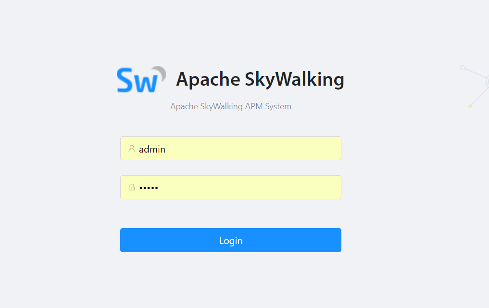

# SkyWalking 服务端配置

## 基于 Docker 安装 ElasticSearch

在 [**为什么需要链路追踪**](/zh/spring-cloud-alibaba/为什么需要链路追踪.html#为什么需要链路追踪) 章节中介绍过 SkyWalking 存储方案有多种，官方推荐的方案是 ElasticSearch ，所以我们需要先安装 ElasticSearch。

### docker-compose.yml

```yaml
version: '3.3'
services:
  elasticsearch:
    image: wutang/elasticsearch-shanghai-zone:6.3.2
    container_name: elasticsearch
    restart: always
    ports:
      - 9200:9200
      - 9300:9300
    environment:
      cluster.name: elasticsearch
```

其中，`9200` 端口号为 SkyWalking 配置 ElasticSearch 所需端口号，`cluster.name` 为 SkyWalking 配置 ElasticSearch 集群的名称

### 测试是否启动成功

浏览器访问 http://elasticsearchIP:9200/ ，浏览器返回如下信息即表示成功启动


## 下载并启动 SkyWalking

官方已经为我们准备好了编译过的服务端版本，下载地址为 http://skywalking.apache.org/downloads/，这里我们需要下载 6.x releases 版本


### 配置 SkyWalking

下载完成后解压缩，进入 `apache-skywalking-apm-incubating/config` 目录并修改 `application.yml` 配置文件


这里需要做三件事：

- 注释 H2 存储方案
- 启用 ElasticSearch 存储方案
- 修改 ElasticSearch 服务器地址

### 启动 SkyWalking

修改完配置后，进入 `apache-skywalking-apm-incubating\bin` 目录，运行 `startup.bat` 启动服务端


通过浏览器访问 http://localhost:8080 出现如下界面即表示启动成功



默认的用户名密码为：admin/admin，登录成功后，效果如下图

