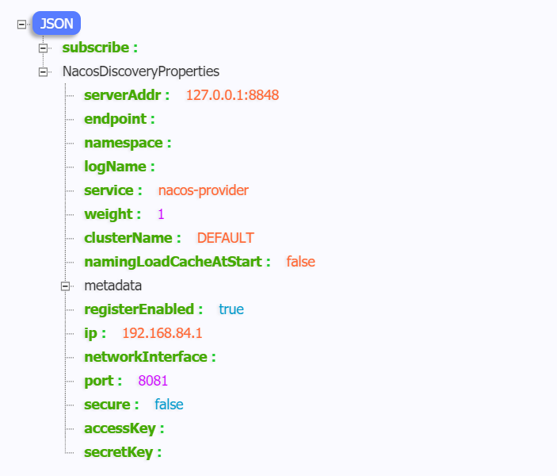

# 创建服务提供者

## 概述

通过一个简单的示例来感受一下如何将服务注册到 Nacos，其实和 Eureka 没有太大差别。

## POM

创建一个工程名为 `hello-spring-cloud-alibaba-nacos-provider` 的服务提供者项目，`pom.xml` 配置如下：

```xml
<?xml version="1.0" encoding="UTF-8"?>
<project xmlns="http://maven.apache.org/POM/4.0.0" xmlns:xsi="http://www.w3.org/2001/XMLSchema-instance"
         xsi:schemaLocation="http://maven.apache.org/POM/4.0.0 http://maven.apache.org/xsd/maven-4.0.0.xsd">
    <modelVersion>4.0.0</modelVersion>

    <parent>
        <groupId>com.dfd</groupId>
        <artifactId>hello-spring-cloud-alibaba-dependencies</artifactId>
        <version>1.0.0-SNAPSHOT</version>
        <relativePath>../hello-spring-cloud-alibaba-dependencies/pom.xml</relativePath>
    </parent>

    <artifactId>hello-spring-cloud-alibaba-nacos-provider</artifactId>
    <packaging>jar</packaging>

    <name>hello-spring-cloud-alibaba-nacos-provider</name>

    <dependencies>
        <!-- Spring Boot Begin -->
        <dependency>
            <groupId>org.springframework.boot</groupId>
            <artifactId>spring-boot-starter-web</artifactId>
        </dependency>
        <dependency>
            <groupId>org.springframework.boot</groupId>
            <artifactId>spring-boot-starter-actuator</artifactId>
        </dependency>
        <dependency>
            <groupId>org.springframework.boot</groupId>
            <artifactId>spring-boot-starter-test</artifactId>
            <scope>test</scope>
        </dependency>
        <!-- Spring Boot End -->

        <!-- Spring Cloud Begin -->
        <dependency>
            <groupId>org.springframework.cloud</groupId>
            <artifactId>spring-cloud-starter-alibaba-nacos-discovery</artifactId>
        </dependency>
        <!-- Spring Cloud End -->
    </dependencies>

    <build>
        <plugins>
            <plugin>
                <groupId>org.springframework.boot</groupId>
                <artifactId>spring-boot-maven-plugin</artifactId>
                <configuration>
                    <mainClass>com.dfd.hello.spring.cloud.alibaba.nacos.provider.NacosProviderApplication</mainClass>
                </configuration>
            </plugin>
        </plugins>
    </build>
</project>
```

## Application

通过 `@EnableDiscoveryClient` 注解表明是一个 Nacos 客户端，该注解是 Spring Cloud 提供的原生注解

```java
package com.dfd.hello.spring.cloud.alibaba.nacos.provider;

import org.springframework.boot.SpringApplication;
import org.springframework.boot.autoconfigure.SpringBootApplication;
import org.springframework.cloud.client.discovery.EnableDiscoveryClient;
import org.springframework.web.bind.annotation.GetMapping;
import org.springframework.web.bind.annotation.PathVariable;
import org.springframework.web.bind.annotation.RestController;

@SpringBootApplication
@EnableDiscoveryClient
public class NacosProviderApplication {
    public static void main(String[] args) {
        SpringApplication.run(NacosProviderApplication.class, args);
    }

    @RestController
    public class EchoController {
        @GetMapping(value = "/echo/{message}")
        public String echo(@PathVariable String message) {
            return "Hello Nacos Discovery " + message;
        }
    }
}
```

## application.yml

```yaml
spring:
  application:
    name: nacos-provider
  cloud:
    nacos:
      discovery:
        server-addr: 127.0.0.1:8848

server:
  port: 8081

management:
  endpoints:
    web:
      exposure:
        include: "*"
```

## 启动工程

通过浏览器访问 `http://localhost:8848/nacos`，即 Nacos Server 网址


你会发现一个服务已经注册在服务中了，服务名为 `nacos-provider`

这时打开 `http://localhost:8081/echo/hi` ，你会在浏览器上看到：

```html
Hello Nacos Discovery hi
```

## 服务的端点检查

spring-cloud-starter-alibaba-nacos-discovery 在实现的时候提供了一个 EndPoint, EndPoint 的访问地址为 `http://ip:port/actuator/nacos-discovery`。 EndPoint 的信息主要提供了两类:

```text
1、subscribe: 显示了当前有哪些服务订阅者
2、NacosDiscoveryProperties: 显示了当前服务实例关于 Nacos 的基础配置
```

通过浏览器访问 `http://localhost:8081/actuator/nacos-discovery` 你会在浏览器上看到：



## 附：Nacos Starter 更多配置项信息

| 配置项          | Key                                            | 默认值                     | 说明                                                         |
| --------------- | ---------------------------------------------- | -------------------------- | ------------------------------------------------------------ |
| 服务端地址      | spring.cloud.nacos.discovery.server-addr       | 无                         | Nacos Server 启动监听的ip地址和端口                          |
| 服务名          | spring.cloud.nacos.discovery.service           | ${spring.application.name} | 给当前的服务命名                                             |
| 权重            | spring.cloud.nacos.discovery.weight            | 1                          | 取值范围 1 到 100，数值越大，权重越大                        |
| 网卡名          | spring.cloud.nacos.discovery.network-interface | 无                         | 当IP未配置时，注册的IP为此网卡所对应的IP地址，如果此项也未配置，则默认取第一块网卡的地址 |
| 注册的IP地址    | spring.cloud.nacos.discovery.ip                | 无                         | 优先级最高                                                   |
| 注册的端口      | spring.cloud.nacos.discovery.port              | -1                         | 默认情况下不用配置，会自动探测                               |
| 命名空间        | spring.cloud.nacos.discovery.namespace         | 无                         | 常用场景之一是不同环境的注册的区分隔离，例如开发测试环境和生产环境的资源（如配置、服务）隔离等。 |
| AccessKey       | spring.cloud.nacos.discovery.access-key        | 无                         | 当要上阿里云时，阿里云上面的一个云账号名                     |
| SecretKey       | spring.cloud.nacos.discovery.secret-key        | 无                         | 当要上阿里云时，阿里云上面的一个云账号密码                   |
| Metadata        | spring.cloud.nacos.discovery.metadata          | 无                         | 使用 Map 格式配置，用户可以根据自己的需要自定义一些和服务相关的元数据信息 |
| 日志文件名      | spring.cloud.nacos.discovery.log-name          | 无                         |                                                              |
| 接入点          | spring.cloud.nacos.discovery.enpoint           | UTF-8                      | 地域的某个服务的入口域名，通过此域名可以动态地拿到服务端地址 |
| 是否集成 Ribbon | ribbon.nacos.enabled                           | true                       | 一般都设置成 true 即可                                       |

