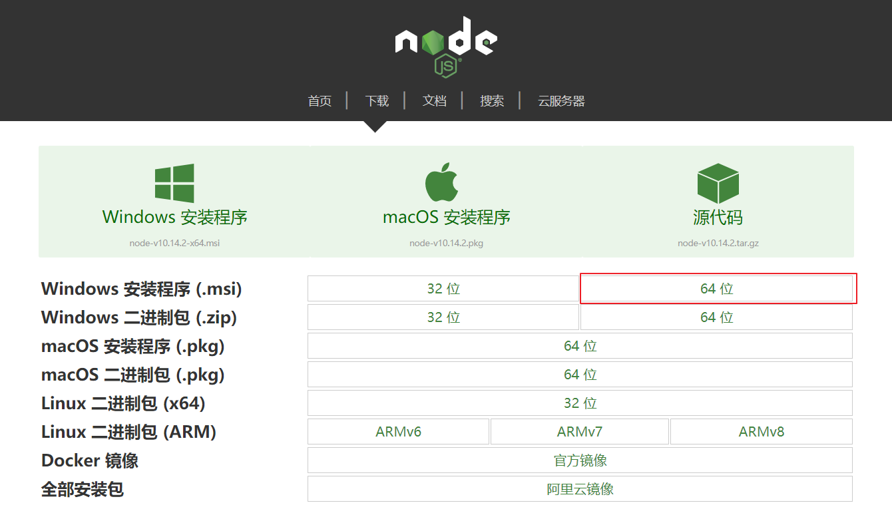
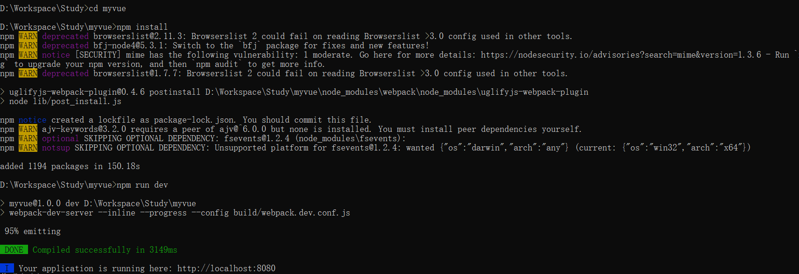

#  第一个 vue-cli 应用程序

## 什么是 vue-cli

`vue-cli` 官方提供的一个脚手架（预先定义好的目录结构及基础代码，咱们在创建 Maven 项目时可以选择创建一个骨架项目，这个骨架项目就是脚手架；可以参考这个人写的 [LeeSite 项目骨架生成工具](https://github.com/topsale/leesite-archetype-webapp)），用于快速生成一个 vue 的项目模板

### 主要功能

- 统一的目录结构
- 本地调试
- 热部署
- 单元测试
- 集成打包上线

### 环境准备

- Node.js（>= 6.x，首选 8.x）
- git

### 安装 vue-cli

- 安装 Node.js

请自行前往 http://nodejs.cn/download 官网下载安装，此处不再赘述



- 安装 Node.js 淘宝镜像加速器（`cnpm`）

```bash
npm install cnpm -g

# 或使用如下语句解决 npm 速度慢的问题
npm install --registry=https://registry.npm.taobao.org
```


- 安装 vue-cli

```bash
cnpm install vue-cli -g
```

- 测试是否安装成功

```bash
# 查看可以基于哪些模板创建 vue 应用程序，通常我们选择 webpack
vue list
```


## 第一个 vue-cli 应用程序

### 创建一个基于 webpack 模板的 vue 应用程序

```bash
# 这里的 myvue 是项目名称，可以根据自己的需求起名
vue init webpack myvue
```


#### 说明

- `Project name`：项目名称，默认 `回车` 即可
- `Project description`：项目描述，默认 `回车` 即可
- `Author`：项目作者，默认 `回车` 即可
- `Install vue-router`：是否安装 `vue-router`，选择 `n` 不安装（后期需要再手动添加）
- `Use ESLint to lint your code`：是否使用 `ESLint` 做代码检查，选择 `n` 不安装（后期需要再手动添加）
- `Set up unit tests`：单元测试相关，选择 `n` 不安装（后期需要再手动添加）
- `Setup e2e tests with Nightwatch`：单元测试相关，选择 `n` 不安装（后期需要再手动添加）
- `Should we run npm install for you after the project has been created`：创建完成后直接初始化，选择 `n`，我们手动执行

### 初始化并运行

```bash
cd myvue
npm install
npm run dev
```



安装并运行成功后在浏览器输入：http://localhost:8080