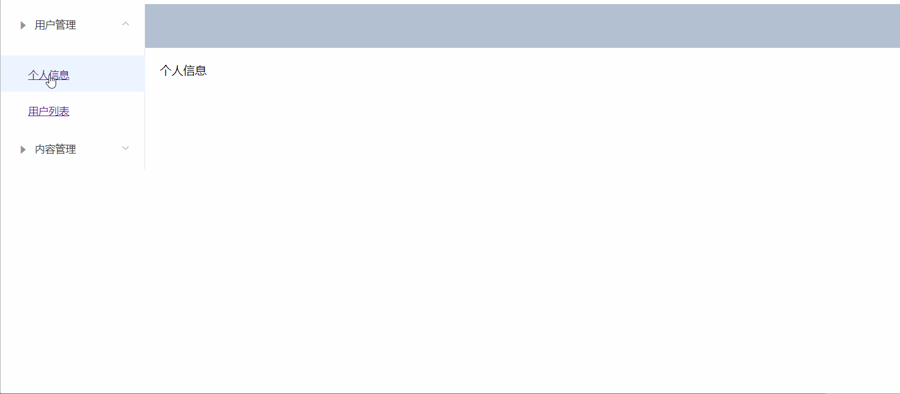

# 配置嵌套路由

## 什么是嵌套路由

嵌套路由又称子路由，在实际应用中，通常由多层嵌套的组件组合而成。同样地，URL 中各段动态路径也按某种结构对应嵌套的各层组件，例如：

```text
/user/foo/profile                     /user/foo/posts
+------------------+                  +-----------------+
| User             |                  | User            |
| +--------------+ |                  | +-------------+ |
| | Profile      | |  +------------>  | | Posts       | |
| |              | |                  | |             | |
| +--------------+ |                  | +-------------+ |
+------------------+                  +-----------------+
```

## 创建嵌套视图组件

### 用户信息组件

在 `views/user` 目录下创建一个名为 `Profile.vue` 的视图组件；该组件在当前章节无任何作用，主要用于展示嵌套效果；

```vue
<template>
    <div>
      个人信息
    </div>
</template>

<script>
    export default {
        name: "UserProfile"
    }
</script>

<style scoped>

</style>
```

### 用户列表组件

在 `views/user` 目录下创建一个名为 `List.vue` 的视图组件；该组件在当前章节无任何作用，主要用于展示嵌套效果；

```vue
<template>
    <div>
      用户列表
    </div>
</template>

<script>
    export default {
        name: "UserList"
    }
</script>

<style scoped>

</style>
```

## 配置嵌套路由

修改 `router` 目录下的 `index.js` 路由配置文件，代码如下：

```javascript
import Vue from 'vue'
import Router from 'vue-router'

import Login from "../views/Login"
import Main from '../views/Main'

// 用于嵌套的路由组件
import UserProfile from '../views/user/Profile'
import UserList from '../views/user/List'

Vue.use(Router);

export default new Router({
  routes: [
    {
      // 登录页
      path: '/login',
      name: 'Login',
      component: Login
    },
    {
      // 首页
      path: '/main',
      name: 'Main',
      component: Main,
      // 配置嵌套路由
      children: [
        {path: '/user/profile', component: UserProfile},
        {path: '/user/list', component: UserList},
      ]
    }
  ]
});
```

说明：主要在路由配置中增加了 `children` 数组配置，用于在该组件下设置嵌套路由

## 修改首页视图

接着上一节的代码，我们修改 `Main.vue` 视图组件，此处使用了 [ElementUI 布局容器组件](http://element-cn.eleme.io/#/zh-CN/component/container)，代码如下：

```vue
<template>
    <div>
      <el-container>
        <el-aside width="200px">
          <el-menu :default-openeds="['1']">
            <el-submenu index="1">
              <template slot="title"><i class="el-icon-caret-right"></i>用户管理</template>
              <el-menu-item-group>
                <el-menu-item index="1-1">
                  <router-link to="/user/profile">个人信息</router-link>
                </el-menu-item>
                <el-menu-item index="1-2">
                  <router-link to="/user/list">用户列表</router-link>
                </el-menu-item>
              </el-menu-item-group>
            </el-submenu>
            <el-submenu index="2">
              <template slot="title"><i class="el-icon-caret-right"></i>内容管理</template>
              <el-menu-item-group>
                <el-menu-item index="2-1">分类管理</el-menu-item>
                <el-menu-item index="2-2">内容列表</el-menu-item>
              </el-menu-item-group>
            </el-submenu>
          </el-menu>
        </el-aside>

        <el-container>
          <el-header style="text-align: right; font-size: 12px">
            <el-dropdown>
              <i class="el-icon-setting" style="margin-right: 15px"></i>
              <el-dropdown-menu slot="dropdown">
                <el-dropdown-item>个人信息</el-dropdown-item>
                <el-dropdown-item>退出登录</el-dropdown-item>
              </el-dropdown-menu>
            </el-dropdown>
            <span>Lusifer</span>
          </el-header>

          <el-main>
            <router-view />
          </el-main>
        </el-container>
      </el-container>
    </div>
</template>

<script>
    export default {
        name: "Main"
    }
</script>

<style scoped lang="scss">
  .el-header {
    background-color: #B3C0D1;
    color: #333;
    line-height: 60px;
  }

  .el-aside {
    color: #333;
  }
</style>
```

说明：

- 在 `<el-main>` 元素中配置了 `<router-view />` 用于展示嵌套路由
- 主要使用 `<router-link to="/user/profile">个人信息</router-link>` 展示嵌套路由内容

## 效果演示

