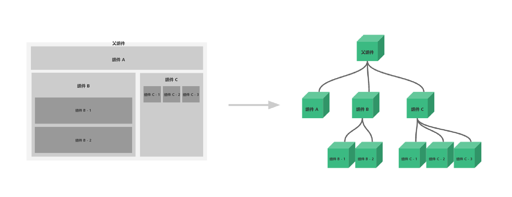

# 组件基础

## 什么是组件

组件是可复用的 Vue 实例，说白了就是一组可以重复使用的模板，跟 `JSTL` 的自定义标签、`Thymeleaf` 的 `th:fragment` 以及 `Sitemesh3` 框架有着异曲同工之妙。通常一个应用会以一棵嵌套的组件树的形式来组织：



例如，你可能会有页头、侧边栏、内容区等组件，每个组件又包含了其它的像导航链接、博文之类的组件。

## 第一个 Vue 组件

**注意：在实际开发中，我们并不会用以下方式开发组件，而是采用 `vue-cli` 创建 `.vue` 模板文件的方式开发，以下方法只是为了让大家理解什么是组件。**

### 使用 `Vue.component()` 方法注册组件

#### JavaScript

```javascript
<script type="text/javascript">
    // 先注册组件
    Vue.component('my-component-li', {
        template: '<li>Hello li</li>'
    });

    // 再实例化 Vue
    var vm = new Vue({
        el: '#vue'
    });
</script>
```

#### HTML

```html
<div id="vue">
    <ul>
        <my-component-li></my-component-li>
    </ul>
</div>
```

#### 说明

- `Vue.component()`：注册组件
- `my-component-li`：自定义组件的名字
- `template`：组件的模板

#### 测试效果


### 使用 `props` 属性传递参数

像上面那样用组件没有任何意义，所以我们是需要传递参数到组件的，此时就需要使用 `props` 属性了

**注意：默认规则下 `props` 属性里的值不能为大写；**

#### JavaScript

```javascript
<script type="text/javascript">
    // 先注册组件
    Vue.component('my-component-li', {
        props: ['item'],
        template: '<li>Hello {{item}}</li>'
    });

    // 再实例化 Vue
    var vm = new Vue({
        el: '#vue',
        data: {
            items: ["张三", "李四", "王五"]
        }
    });
</script>
```

#### HTML

```html
<div id="vue">
    <ul>
        <my-component-li v-for="item in items" v-bind:item="item"></my-component-li>
    </ul>
</div>
```

#### 说明

- `v-for="item in items"`：遍历 Vue 实例中定义的名为 `items` 的数组，并创建同等数量的组件
- `v-bind:item="item"`：将遍历的 `item` 项绑定到组件中 `props` 定义的名为 `item` 属性上；`=` 号左边的 `item` 为 `props` 定义的属性名，右边的为 `item in items` 中遍历的 `item` 项的值

#### 测试效果


### 完整的 HTML

```html
<!DOCTYPE html>
<html>
<head>
    <meta charset="UTF-8">
    <title>布局篇 组件基础</title>
    <script src="https://cdn.jsdelivr.net/npm/vue@2.5.21/dist/vue.js"></script>
</head>
<body>

<div id="vue">
    <ul>
        <my-component-li v-for="item in items" v-bind:item="item"></my-component-li>
    </ul>
</div>

<script type="text/javascript">
    // 先注册组件
    Vue.component('my-component-li', {
        props: ['item'],
        template: '<li>Hello {{item}}</li>'
    });

    // 再实例化 Vue
    var vm = new Vue({
        el: '#vue',
        data: {
            items: ["张三", "李四", "王五"]
        }
    });
</script>
</body>
</html>
```